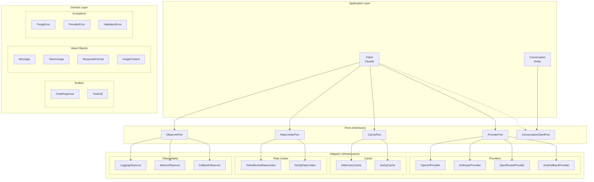
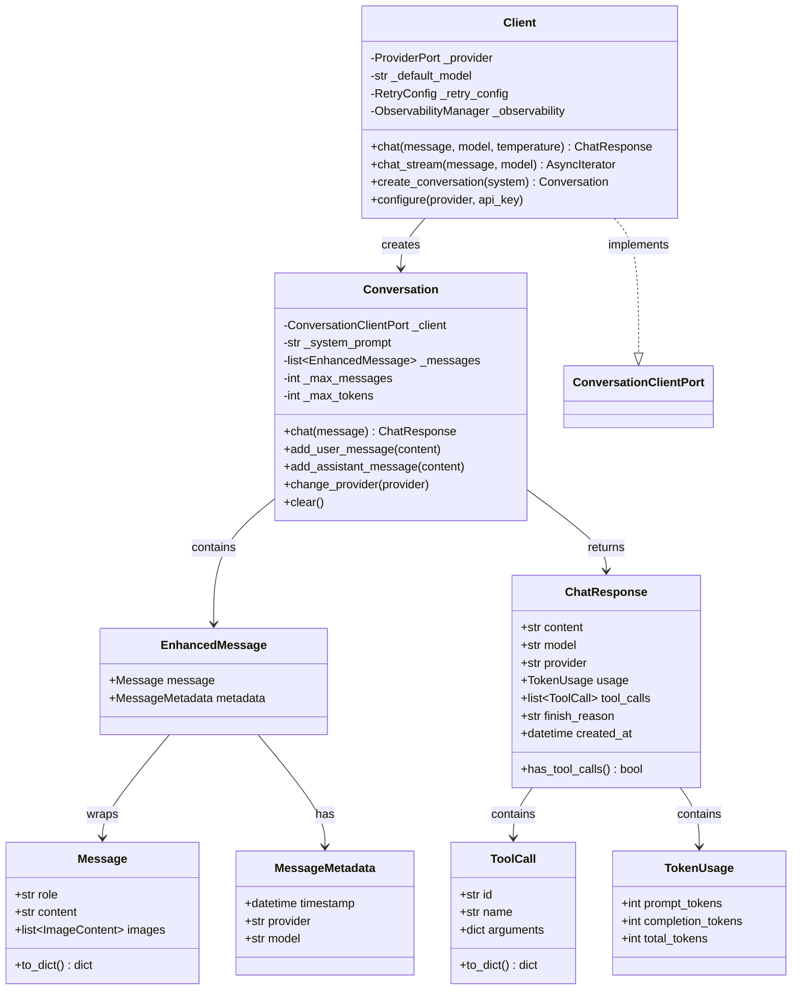
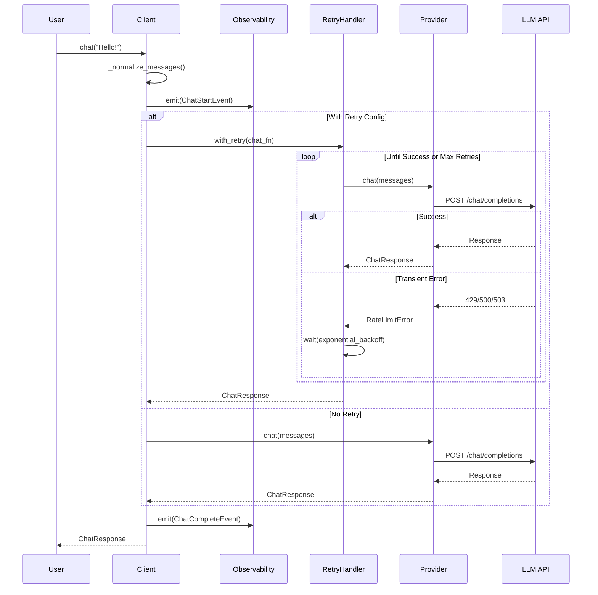
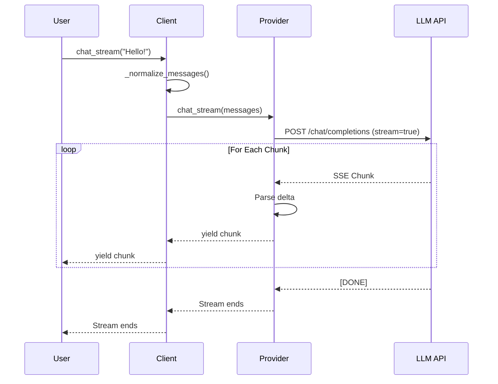
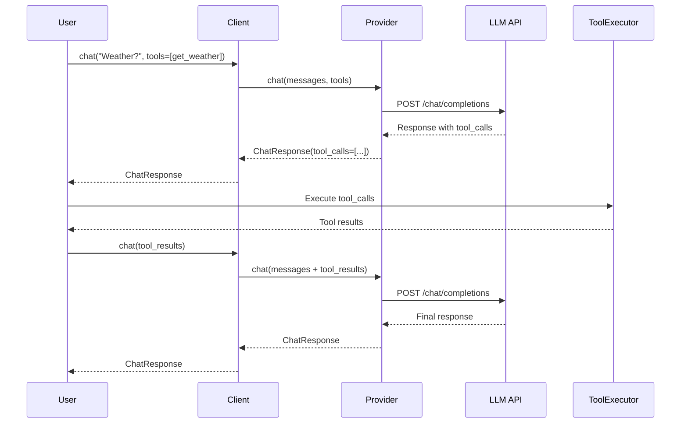
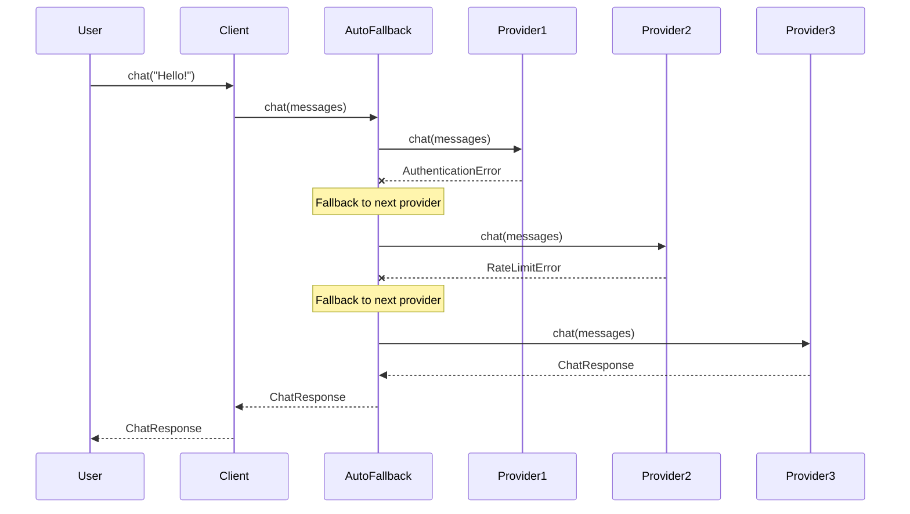
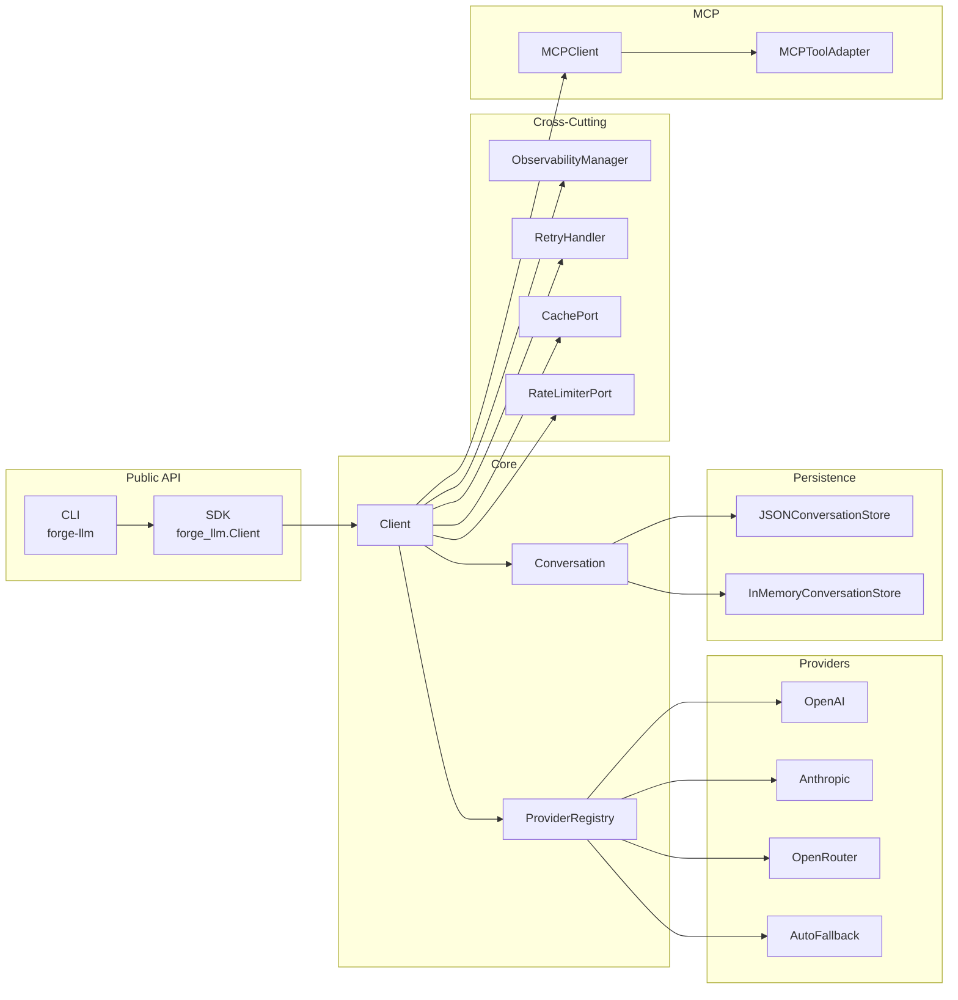

# Arquitetura

O ForgeLLM segue uma **arquitetura hexagonal** (Ports and Adapters), garantindo separação clara entre lógica de domínio e infraestrutura.

## Visão Geral



## Diagrama de Classes do Domínio



## Fluxo de Chat (Sequência)



## Fluxo de Streaming



## Fluxo de Tool Calling



## Fluxo de Auto-Fallback



## Arquitetura de Componentes



## Camadas

### Domain Layer

Contém a lógica de negócio pura, sem dependências externas:

| Tipo | Classes | Responsabilidade |
|------|---------|------------------|
| **Entities** | `ChatResponse`, `Conversation`, `ToolCall` | Objetos com identidade e ciclo de vida |
| **Value Objects** | `Message`, `TokenUsage`, `ResponseFormat`, `ImageContent` | Objetos imutáveis sem identidade |
| **Exceptions** | `ForgeError`, `ProviderError`, `ValidationError` | Hierarquia de erros do domínio |

### Application Layer

Coordena o fluxo de dados e orquestra operações:

| Componente | Responsabilidade |
|------------|------------------|
| **Client** | Facade principal - simplifica uso do SDK |
| **Ports** | Interfaces que definem contratos (DIP) |
| **Registry** | Registro e factory de providers |

### Infrastructure Layer

Implementações concretas dos ports:

| Categoria | Implementações |
|-----------|----------------|
| **Providers** | `OpenAIProvider`, `AnthropicProvider`, `OpenRouterProvider`, `AutoFallbackProvider` |
| **Cache** | `InMemoryCache`, `NoOpCache` |
| **Rate Limiter** | `TokenBucketRateLimiter`, `CompositeRateLimiter`, `NoOpRateLimiter` |
| **Persistence** | `JSONConversationStore`, `InMemoryConversationStore` |
| **Observability** | `LoggingObserver`, `MetricsObserver`, `CallbackObserver` |

## Estrutura de Diretórios

```
src/forge_llm/
├── __init__.py              # Public API exports
├── client.py                # Client facade
├── cli.py                   # CLI interface
│
├── domain/
│   ├── entities.py          # ChatResponse, Conversation, ToolCall
│   ├── value_objects.py     # Message, TokenUsage, ImageContent
│   └── exceptions.py        # Exception hierarchy
│
├── application/
│   └── ports/
│       ├── provider_port.py           # ProviderPort interface
│       └── conversation_client_port.py # ConversationClientPort interface
│
├── providers/
│   ├── registry.py          # ProviderRegistry
│   ├── openai_provider.py   # OpenAI adapter
│   ├── anthropic_provider.py # Anthropic adapter
│   ├── openrouter_provider.py # OpenRouter adapter
│   └── auto_fallback_provider.py # Auto-fallback strategy
│
├── infrastructure/
│   ├── cache.py             # Cache implementations
│   ├── rate_limiter.py      # Rate limiter implementations
│   └── retry.py             # Retry with exponential backoff
│
├── observability/
│   ├── manager.py           # ObservabilityManager
│   ├── events.py            # Event types
│   └── observers.py         # Observer implementations
│
├── persistence/
│   ├── store.py             # ConversationStore interface
│   └── json_store.py        # JSON file persistence
│
├── mcp/
│   ├── client.py            # MCP client
│   └── adapter.py           # Tool adapter
│
└── utils/
    ├── token_counter.py     # Token counting
    ├── response_validator.py # Response validation
    └── summarizer.py        # Conversation summarization
```

## Princípios de Design

### 1. Dependency Inversion (DIP)

O domínio não depende de implementações concretas:

```python
# Port (abstração)
class ProviderPort(ABC):
    @abstractmethod
    async def chat(self, messages: list[Message]) -> ChatResponse: ...

# Adapter (implementação)
class OpenAIProvider(ProviderPort):
    async def chat(self, messages: list[Message]) -> ChatResponse:
        # Implementação específica OpenAI
        ...

# Client depende do Port, não do Adapter
class Client:
    def __init__(self, provider: ProviderPort): ...
```

### 2. Single Responsibility

Cada classe tem uma única responsabilidade:

- `Client`: Orquestra operações
- `ProviderRegistry`: Cria providers
- `RetryHandler`: Gerencia retries
- `ObservabilityManager`: Gerencia eventos

### 3. Open/Closed

Extensível sem modificação:

```python
# Adicionar novo provider sem modificar código existente
@ProviderRegistry.register("gemini")
class GeminiProvider(ProviderPort):
    ...
```

### 4. Interface Segregation

Interfaces específicas e focadas:

```python
class CachePort(ABC):
    async def get(self, key: CacheKey) -> Any | None: ...
    async def set(self, key: CacheKey, value: Any) -> None: ...

class RateLimiterPort(ABC):
    async def acquire(self) -> None: ...
    async def release(self) -> None: ...
```

## Benefícios

| Benefício | Descrição |
|-----------|-----------|
| **Testabilidade** | Fácil substituir implementações por mocks |
| **Extensibilidade** | Adicionar novos providers implementando `ProviderPort` |
| **Manutenibilidade** | Separação clara de responsabilidades |
| **Flexibilidade** | Trocar implementações sem afetar o domínio |
| **Observabilidade** | Sistema de eventos para logging/métricas |
| **Resiliência** | Retry automático e fallback entre providers |
