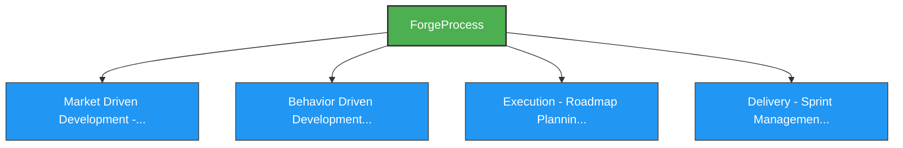
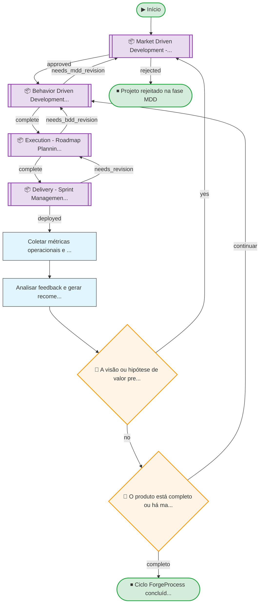
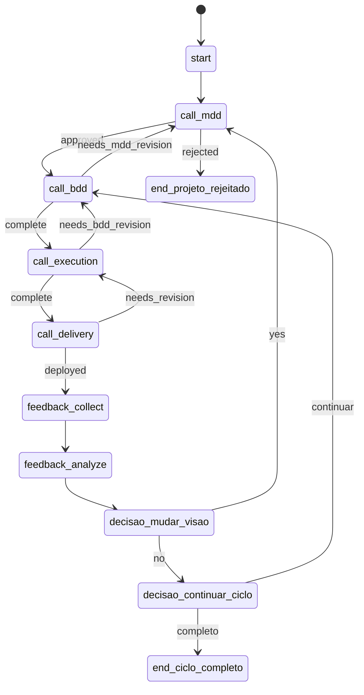

# Resumo do Processo

**ID:** `forgeprocess`
**Versão:** 2.0.0
**Título:** ForgeProcess
**Tipo:** Processo Principal

**Descrição:**
> Ciclo de raciocínio que transforma intenção de valor em comportamentos verificáveis, código testado, execução observável e aprendizado contínuo, medindo progresso em unidades de valor de negócio em vez de tempo, tarefas ou story points.

## Subprocessos

| ID | Descrição | Retornos Esperados |
|----|-----------|-------------------|
| `mdd` | Market Driven Development - validação de mercado e definição de valor | approved, rejected |
| `bdd` | Behavior Driven Development - especificação de comportamentos em Gherkin | complete, needs_mdd_revision |
| `execution` | Execution - Roadmap Planning + TDD | complete, needs_bdd_revision |
| `delivery` | Delivery - Sprint Management + Review | deployed, needs_revision |

## Fases

| Fase | Nome | Passos | Subprocesso |
|------|------|--------|-------------|
| `mdd` | MDD — Market Driven Development | 0 | mdd/PROCESS.yml |
| `bdd` | BDD — Behavior Driven Development | 0 | bdd/PROCESS.yml |
| `execution` | Execution — Roadmap + TDD | 0 | execution/PROCESS.yml |
| `delivery` | Delivery — Sprint + Review | 0 | delivery/PROCESS.yml |
| `feedback` | Feedback — Reflexão | 2 | - |

## Fluxo

**Total de nós:** 11

| Tipo | Quantidade |
|------|------------|
| 📦 Chamada | 4 |
| 🔀 Decisão | 2 |
| ⏹ Fim | 2 |
| ▶ Início | 1 |
| 📋 Passo | 2 |

**Decisões:**
- 👤 HIL (humanas): 2

---

## Hierarquia de Processos

---

## Diagrama de Fluxo

---

## Diagrama de Estados

