# Process Documentation

Este diretório contém a documentação **padrão do ForgeProcess** – os processos e metodologias que podem ser aplicados em qualquer projeto (por exemplo, forgeLLMClient).

> **Importante sobre este repositório vs. projetos alvo**
>
> - Neste repositório, os arquivos do ForgeProcess vivem em `processes/forgeprocess/`.
> - Nos projetos que **usam** o ForgeProcess, a estrutura alvo será criada em `process/`, `specs/`, `project/`, etc.
> - Comandos como `symforge init -p forgeprocess myproject` (futuro utilitário) deverão copiar/gerar essa estrutura alvo em um projeto real.
> - Sempre que este guia mencionar caminhos como `process/...`, `specs/...` ou `project/...`, está descrevendo a **estrutura alvo de um projeto**, não a estrutura física deste repositório.

## 📂 Estrutura

```text
process/                       # Diretório alvo em um projeto que usa o ForgeProcess
├── README.md                  # Este arquivo
├── PROCESS.md                 # Processo completo (overview)
├── process_execution_state.md # Roteiro operacional + estado vivo do ForgeProcess
├── state/
│   └── forgeprocess_state.yml # Fonte de verdade do estado (para orquestração por LLM)
│
├── mdd/                       # Market-Driven Development
│   ├── MDD_process.md
│   ├── etapa_01-05.md
│   └── templates/
│
├── bdd/                       # Behavior-Driven Development
│   ├── BDD_PROCESS.md
│   ├── etapa_01-06.md
│   └── templates/
│
├── execution/                 # Fase de Execução (arquitetura + TDD)
│   ├── PROCESS.md
│   ├── roadmap_planning/
│   │   └── ROADMAP_PLANNING_PROCESS.md
│   └── tdd/
│       └── TDD_PROCESS.md
│
├── delivery/                  # Fase de Delivery (sprints + reviews)
│   ├── PROCESS.md
│   ├── sprint/
│   │   └── SPRINT_PROCESS.md
│   └── review/
│       └── REVIEW_PROCESS.md
│
├── docs/                      # Documentação complementar
│   ├── diagrams/              # Diagramas (Mermaid)
│   └── policies/              # Políticas de processo (ex.: MVP)
│
└── symbiotes/                 # Symbiotas (agentes) do ForgeProcess
    ├── mdd_coach/
    ├── mdd_publisher/
    ├── bill_review/
    └── jorge_forge/
```

---

## 🤖 Entrypoint para Agentes / LLMs

Se você é um **symbiota** ou uma **LLM orquestradora**, use esta sequência para se localizar:

1. **Ler o estado vivo**  
   - Abrir `process/state/forgeprocess_state.yml` (fonte de verdade).  
   - Usar `current_phase`, `last_completed_step` e `next_recommended_step` como ponto de partida.

2. **Ler o resumo da fase atual**  
   - Conforme `current_phase`, abrir o `SUMMARY_FOR_AGENTS.md` correspondente:
     - `mdd/SUMMARY_FOR_AGENTS.md`
     - `bdd/SUMMARY_FOR_AGENTS.md`
     - `execution/SUMMARY_FOR_AGENTS.md`
     - `delivery/SUMMARY_FOR_AGENTS.md`
     - `feedback/SUMMARY_FOR_AGENTS.md`

3. **Localizar a definição detalhada da etapa**  
   - Usar o ID da etapa (ex.: `mdd.01.concepcao_visao`) para encontrar o bloco correspondente em:
     - `mdd/MDD_process.md`
     - `bdd/BDD_PROCESS.md`
     - `execution/roadmap_planning/ROADMAP_PLANNING_PROCESS.md`
     - `execution/tdd/TDD_PROCESS.md`
     - `delivery/sprint/SPRINT_PROCESS.md`
     - `delivery/review/REVIEW_PROCESS.md`

4. **Respeitar o manifesto do symbiota**  
   - No `symbiotes/<nome>/prompt.md`, ler o front‑matter:
     - `symbiote_id`, `phase_scope`, `allowed_steps`, `allowed_paths`, `forbidden_paths`.
   - Atuar **apenas** nas etapas e caminhos autorizados.

5. **Atualizar estado após cada etapa**  
   - Atualizar primeiro `state/forgeprocess_state.yml`.  
   - Depois, refletir o novo estado no cabeçalho de `process_execution_state.md`.

6. **Seguir o guia de orquestração por LLM**  
   - Ver `docs/LLM_ORCHESTRATION_GUIDE.md` para o protocolo completo de:
     - escolha de próximo step,
     - briefing da etapa,
     - execução assistida,
     - conclusão e atualização de estado.

---

## 📚 Processos Disponíveis

### 1. [MDD - Market-Driven Development](mdd/MDD_process.md)
**O que é**: Validar hipótese de mercado ANTES de implementar

**Quando usar**: Antes de iniciar novo produto ou feature grande

**Etapas**:
1. Concepção da Visão (hipótese → visão)
2. Síntese Executiva (visão → sumário)
3. Pitch de Valor (sumário → pitch)
4. Validação Pública (sites A/B/C)
5. Avaliação Estratégica (decisão go/no-go)

**Artefatos (estrutura alvo)**: `project/mdd-artifacts/` (visao.md, sumario_executivo.md, etc.)

**Público**: Product Owners, Stakeholders

---

### 2. [BDD - Behavior-Driven Development](bdd/BDD_PROCESS.md)
**O que é**: Transformar valor validado em especificações executáveis (Gherkin)

**Quando usar**: Após MDD aprovado, antes de TDD

**Etapas**:
1. Mapeamento de Comportamentos
2. Escrita de Features (Gherkin)
3. Organização e Tagging
4. Criação de tracks.yml
5. Skeleton e Automação
6. Handoff para TDD

**Artefatos (estrutura alvo)**: `specs/bdd/` (*.feature, tracks.yml, behavior_mapping.md)

**Público**: Product Owners, Desenvolvedores

---

### 3. [Execution Process](execution/PROCESS.md) ⭐
**O que é**: Fase de **Execução** que conecta BDD a um backlog técnico claro e código testado, agrupando Roadmap Planning e TDD.

**Quando usar**: Após BDD completo, durante o detalhamento técnico e implementação guiada por testes.

**Subprocessos principais**:
1. **Roadmap Planning** – arquitetura, dependências, estimativas e backlog (`execution/roadmap_planning/ROADMAP_PLANNING_PROCESS.md`).
2. **TDD Workflow** – implementação guiada por testes (`execution/tdd/TDD_PROCESS.md`).

**Artefatos (estrutura alvo)**:
- `specs/roadmap/` (TECH_STACK.md, ADRs, HLD.md, LLD.md, ROADMAP.md, BACKLOG.md, dependency_graph.md, estimates.yml)
- `src/`, `tests/`, `docs/`, `examples/` (código e testes)

**Público**: Tech Leads, Arquitetos, Desenvolvedores

---

### 3.1. `process_execution_state.md` — Roteiro + Estado Vivo do Processo

**O que é**: um arquivo Markdown que funciona como:
- **checklist operacional completo** de todas as fases (MDD, BDD, Execution, Delivery, Feedback), com entradas/saídas e critérios de conclusão;
- **estado vivo** do ForgeProcess no projeto (campos `current_phase`, `last_completed_step`, `next_recommended_step`, etc.).

**Quando usar**:
- No início de **cada fase**, o orquestrador ou symbiota responsável (ex.: `mdd_coach`, `bdd_coach`, `mark_arc`, `tdd_coder`, `forge_coder`, `bill_review`, `jorge_the_forge`) deve consultá‑lo para saber:
  - onde o projeto está (fase/etapa atual),
  - qual o próximo passo recomendado,
  - quais artefatos já existem ou ainda faltam.
- Ao final de **cada etapa significativa**, o symbiota em execução deve:
  - marcar os checkboxes correspondentes,
  - atualizar `current_phase`, `last_completed_step` e `next_recommended_step`,
  - deixar o arquivo pronto para o próximo symbiota assumir.

**Por que é útil**:
- Evita que agentes “cortem caminho” (ex.: ir direto para TDD sem Roadmap Planning).
- Garante handoffs suaves entre symbiotas e humanos (cada um sabe exatamente de onde retomar).
- Serve como **ponto único de verdade** sobre o progresso real do ForgeProcess dentro do projeto.

### 4. [Delivery Process](delivery/PROCESS.md) ⭐
**O que é**: Fase de **Delivery contínua**, responsável por organizar sprints, conduzir reviews e consolidar entregas e aprendizado.

**Quando usar**: Depois que o backlog técnico está pronto e durante a operação contínua de sprints.

**Subprocessos principais**:
1. **Sprint Management** – organização do trabalho em sprints e sessões (`delivery/sprint/SPRINT_PROCESS.md`).
2. **Review Guidelines** – validação técnica (bill-review), de processo (Jorge) e de negócio (`delivery/review/REVIEW_PROCESS.md`).

**Artefatos (estrutura alvo)**:
- `project/sprints/sprint-N/` (planning.md, progress.md, review.md, jorge-process-review.md, retrospective.md)
- `project/reviews/` (reviews técnicos)

**Público**: Desenvolvedores, Stakeholders, Jorge the Forge, bill-review symbiota

---

> **Revisões de Fase (Jorge & bill-review)**
>
> - Ao final das fases **MDD (3)**, **BDD (4)** e **Execution (5)**, o symbiota
>   `jorge_the_forge` deve ser acionado para auditar se o projeto está cumprindo
>   o ForgeProcess para aquela fase (valor, comportamento, execução).
> - Ao final da fase **Delivery (6)**, `bill_review` e `jorge_the_forge` revisam
>   juntos o trabalho:
>   - bill-review: foco técnico (código, testes, arquitetura);
>   - Jorge: foco de processo (se Sprint Workflow, BDD/TDD e reviews foram seguidos).
> - Ao final da fase **Feedback (7)**, `jorge_the_forge` conduz o registro de
>   aprendizados (artefatos de feedback e recomendações); `bill_review` pode ser
>   acionado para comentar implicações técnicas, mas o registro formal fica com Jorge.

## 🔄 Workflow Completo (Visão Geral)

```mermaid
flowchart TD
    MDD["1. MDD (Validação de Mercado)"] --> BDD["2. BDD (Especificações)"]
    BDD --> EXEC["3. Execution (Arquitetura + TDD)"]
    EXEC --> DEL["4. Delivery (Sprints + Reviews)"]
    DEL --> FB["5. Feedback (Produção e Métricas)"]
    FB --> MDD
```



---

## 📖 Como Usar Esta Documentação

### Para Desenvolvedores (Agent Coders)
1. **Implementação**: Siga [TDD Process](execution/tdd/TDD_PROCESS.md)
2. **Sessões**: Consulte [Sprint Process](delivery/sprint/SPRINT_PROCESS.md)
3. **Review**: Use [Review Guidelines](delivery/review/REVIEW_PROCESS.md)

### Para Stakeholders
1. **Validação de mercado**: [MDD Process](mdd/MDD_process.md)
2. **Especificação**: [BDD Process](bdd/BDD_PROCESS.md)
3. **Planejamento**: [Roadmap Planning](execution/roadmap_planning/ROADMAP_PLANNING_PROCESS.md)
4. **Aprovação**: [Review Guidelines](delivery/review/REVIEW_PROCESS.md)

### Para Novos Membros
1. Leia este README (overview)
2. Leia [PROCESS.md](PROCESS.md) (visão completa)
3. Estude [TDD Process](execution/tdd/TDD_PROCESS.md) (essencial para dev)
4. Pratique com feature simples (F01 - config.feature)

---

## 🎯 Princípios Fundamentais

### 1. Market-First
- ✅ **Validar antes de construir**: MDD garante que construímos o que o mercado quer
- ❌ **Não construir especulativamente**: Sem validação = desperdício

### 2. Behavior-Driven
- ✅ **Especificações executáveis**: Gherkin = requisitos + testes
- ✅ **Linguagem ubíqua**: Stakeholders e devs falam a mesma língua

### 3. Test-Driven
- ✅ **Testes primeiro**: RED → GREEN → REFACTOR obrigatório
- ✅ **Cobertura ≥80%**: Garantia de qualidade

### 4. Session-Based (Agent Coders)
- ✅ **On-demand work**: Não daily standups, mas sessions síncronas
- ✅ **Review na sessão**: Aprovação imediata, não assíncrona

### 5. Continuous Review
- ✅ **bill-review symbiota**: Automação de compliance checks
- ✅ **Stakeholder validation**: Demo + aprovação por feature

### 6. Organized Process Structure ⚠️ IMPORTANTE
- ✅ **NUNCA criar arquivos na raiz /process**: Sempre organizar em subpastas
- ✅ **Cada processo tem suas etapas**: bdd/etapa_XX.md, review/etapa_XX.md, etc.
- ✅ **Atualizar o processo adequado**: Ao adicionar nova etapa, atualizar o *_PROCESS.md correspondente
- ❌ **NÃO criar documentos soltos**: Evita desorganização e dificulta manutenção
- **Exemplo Correto**:
  - `process/delivery/review/etapa_stakeholder_validation.md` ✅
  - `process/delivery/review/REVIEW_PROCESS.md` (atualizado para referenciar) ✅
- **Exemplo Errado**:
  - `process/pre_stakeholder_validation.md` ❌ (raiz, sem contexto)

---

## 📊 Métricas de Qualidade

| Métrica | Target | Medição |
|---------|--------|---------|
| **Market Validation** | >70% interesse | Landing page conversions (MDD) |
| **BDD Coverage** | 100% features | specs/bdd/*.feature |
| **Test Coverage** | ≥80% | pytest-cov |
| **Lint Errors** | 0 | ruff |
| **Type Errors** | 0 | mypy |
| **Forgebase Compliance** | ✅ | bill-review |
| **Velocity** | 10-15 pts/sprint | project/sprints/*/progress.md |

---

## 🔗 Documentos Relacionados

### Especificações (estrutura alvo em `/specs`)
- **BDD Features**: `/specs/bdd/` - Requisitos em Gherkin
- **ADRs**: `/specs/adr/` - Decisões arquiteturais
- **Roadmap**: `/specs/roadmap/` - Plano estratégico + backlog

### Execução (estrutura alvo em `/project`)
- **Sprints**: `/project/sprints/` - Progresso por sprint
- **Reviews**: `/project/reviews/` - Reviews técnicos (bill-review)
- **MDD Artifacts**: `/project/mdd-artifacts/` - Artefatos de negócio (visão, pitch, etc.)

### Código (estrutura alvo em `/src`)
- **Core**: `/src/forgellmclient/core/` - Business logic
- **Adapters**: `/src/forgellmclient/adapters/` - External integrations
- **Ports**: `/src/forgellmclient/ports/` - Interfaces

### Layout do Projeto (estrutura alvo)
- **Project Layout**: `process/docs/layout/PROJECT_LAYOUT.md` – contrato de estrutura usado por `symforge init -p forgeprocess myproject`

---

## ❓ FAQ

**P: Qual a diferença entre /process e /specs?**
R: `/process` = **como fazemos** (metodologia), `/specs` = **o que fazemos** (requisitos)

**P: Devo seguir TDD mesmo para features simples?**
R: Sim. TDD é obrigatório para todas as features (garantia de qualidade).

**P: O que é "session-based" vs "daily standups"?**
R: Session-based = trabalho on-demand (2-3h) com review síncrono. Daily standups = trabalho contínuo com sync assíncrono.

**P: Quando usar bill-review symbiota?**
R: Após cada feature complexa (>5 pts) e ao final de cada sprint (obrigatório).

**P: Posso pular MDD e ir direto para TDD?**
R: Não recomendado. MDD evita desperdício construindo features que ninguém quer.

---

## 📝 Histórico de Atualizações

| Data | Mudança | Autor |
|------|---------|-------|
| 2025-11-05 | Reorganização em subpastas (tdd/, sprint/, review/) | Claude Code |
| 2025-11-05 | Criação inicial do /process | Claude Code |

---

**Última Atualização**: 2025-11-05
**Status**: Em evolução (Sprint 1 em andamento)
**Manutenção**: Atualizar após cada sprint review
