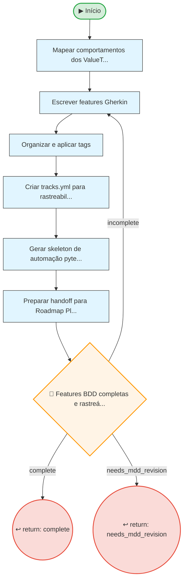
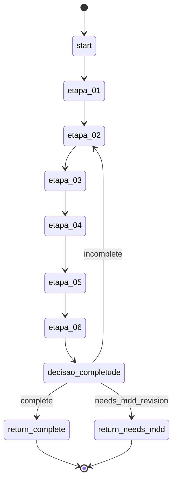

# Resumo do Processo

**ID:** `bdd`
**Versão:** 1.0.0
**Título:** BDD - Behavior Driven Development
**Tipo:** Subprocesso

**Descrição:**
> Processo que transforma valor validado (MDD) em especificação executável (Gherkin), estabelecendo um contrato de comportamento entre stakeholders, produto, desenvolvimento e QA.

## Fases

| Fase | Nome | Passos | Subprocesso |
|------|------|--------|-------------|
| `bdd_main` | Behavior Driven Development | 6 | - |

## Fluxo

**Total de nós:** 10

| Tipo | Quantidade |
|------|------------|
| 🔀 Decisão | 1 |
| ↩ Retorno | 2 |
| ▶ Início | 1 |
| 📋 Passo | 6 |

**Decisões:**
- 🤖 Automáticas: 1

---

## Diagrama de Fluxo

---

## Diagrama de Estados

