# Resumo do Processo

**ID:** `bdd`
**Versão:** 1.0.0
**Título:** BDD - Behavior Driven Development
**Tipo:** Subprocesso

**Descrição:**
> Processo que transforma valor validado (MDD) em especificação executável (Gherkin), estabelecendo um contrato de comportamento entre stakeholders, produto, desenvolvimento e QA.

## Fases

| Fase | Nome | Passos | Subprocesso |
|------|------|--------|-------------|
| `bdd_main` | Behavior Driven Development | 6 | - |

## Fluxo

**Total de nós:** 10

| Tipo | Quantidade |
|------|------------|
| 🔀 Decisão | 1 |
| ↩ Retorno | 2 |
| ▶ Início | 1 |
| 📋 Passo | 6 |

**Decisões:**
- 🤖 Automáticas: 1

---

## Diagrama de Fluxo

```mermaid
flowchart TD
    start(["▶ Início"])
    etapa_01["Mapear comportamentos dos ValueT..."]
    etapa_02["Escrever features Gherkin"]
    etapa_03["Organizar e aplicar tags"]
    etapa_04["Criar tracks.yml para rastreabil..."]
    etapa_05["Gerar skeleton de automação pyte..."]
    etapa_06["Preparar handoff para Roadmap Pl..."]
    decisao_completude{"🤖 Features BDD completas e rastreá..."}
    return_complete(("↩ return: complete"))
    return_needs_mdd(("↩ return: needs_mdd_revision"))

    start --> etapa_01
    etapa_01 --> etapa_02
    etapa_02 --> etapa_03
    etapa_03 --> etapa_04
    etapa_04 --> etapa_05
    etapa_05 --> etapa_06
    etapa_06 --> decisao_completude
    decisao_completude -->|"complete"| return_complete
    decisao_completude -->|"incomplete"| etapa_02
    decisao_completude -->|"needs_mdd_revision"| return_needs_mdd

    %% Estilos
    classDef startEnd fill:#d4edda,stroke:#28a745,stroke-width:2px
    classDef stepNode fill:#e1f5ff,stroke:#333,stroke-width:1px
    classDef decisionNode fill:#fff4e6,stroke:#ff9800,stroke-width:2px
    classDef subprocessCall fill:#e8daef,stroke:#8e44ad,stroke-width:2px
    classDef returnNode fill:#fadbd8,stroke:#e74c3c,stroke-width:2px
    class start startEnd
    class etapa_01,etapa_02,etapa_03,etapa_04,etapa_05,etapa_06 stepNode
    class decisao_completude decisionNode
    class return_complete,return_needs_mdd returnNode
```

---

## Diagrama de Estados

