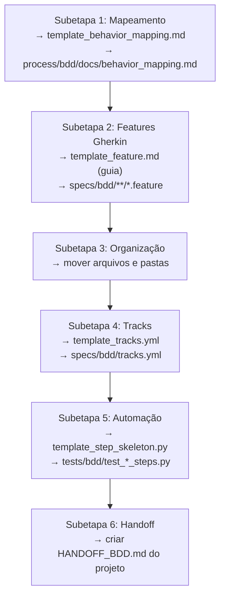

# Templates BDD

Esta pasta contém templates para todas as subetapas do **BDD Process**.

---

## 📁 Templates Disponíveis

| Template | Subetapa | Uso | Saída Esperada |
|----------|----------|-----|----------------|
| `template_behavior_mapping.md` | Etapa 1 | Mapear ValueTracks → Comportamentos | `process/bdd/docs/behavior_mapping.md` |
| `template_feature.md` | Etapa 2 | Escrever features Gherkin | `specs/bdd/**/*.feature` |
| `template_tracks.yml` | Etapa 4 | Criar rastreabilidade | `specs/bdd/tracks.yml` |
| `template_step_skeleton.py` | Etapa 5 | Criar step definitions vazias | `tests/bdd/test_*_steps.py` |

---

## 🔹 template_behavior_mapping.md

**Subetapa:** 1 - Mapeamento de Comportamentos

**Propósito:**
Transformar ValueTracks do MDD em comportamentos concretos que serão especificados em Gherkin.

**Como usar:**
1. Copiar template
2. Para cada ValueTrack do `visao.md`:
   - Listar comportamentos (ação + resultado esperado)
   - Identificar casos de erro
   - Agrupar por domínio técnico
3. Revisar com PO/Stakeholder
4. Salvar em `process/bdd/docs/behavior_mapping.md`

**Exemplo de uso:**
```bash
cp process/bdd/templates/template_behavior_mapping.md \
   process/bdd/docs/behavior_mapping.md

# Editar behavior_mapping.md com comportamentos do projeto
```

---

## 🔹 template_feature.md

**Subetapa:** 2 - Escrita de Features Gherkin

**Propósito:**
Guia para escrever features Gherkin seguindo o padrão Forge (PT-BR, tags, estrutura).

**Como usar:**
1. Para cada comportamento mapeado, criar arquivo `.feature`
2. Usar estrutura do template:
   - Tags (@sdk, @ci-fast, etc)
   - FUNCIONALIDADE (PARA/COMO/QUERO)
   - CONTEXTO (pré-condições compartilhadas)
   - CENÁRIO (casos de sucesso e erro)
   - ESQUEMA DO CENÁRIO (casos parametrizados)
3. Salvar em `specs/bdd/[prefixo]_[dominio]/[nome].feature`

**Estrutura de output:**
```
specs/bdd/
├── 10_forge_core/
│   └── chat.feature       ← Criado a partir do template
├── 20_symclient_http/
│   └── chat_http.feature  ← Criado a partir do template
...
```

---

## 🔹 template_tracks.yml

**Subetapa:** 4 - Criação de tracks.yml

**Propósito:**
Estabelecer rastreabilidade entre features BDD ↔ ValueTracks ↔ Métricas.

**Como usar:**
1. Copiar template
2. Para cada track (VALUE ou SUPPORT):
   - Definir id, name, owner
   - Listar métricas mensuráveis
   - Mapear features que implementam o track
   - Adicionar notes explicando contexto
3. Validar sintaxe YAML: `yq eval tracks.yml`
4. Salvar em `specs/bdd/tracks.yml`

**Exemplo:**
```yaml
tracks:
  - id: value_forge_chat_baseline
    type: VALUE
    name: "Chat básico multi-provedor"
    owner: "Time de Produto"
    metrics:
      - adocao_dev
      - tempo_integracao
    features:
      - specs/bdd/10_forge_core/chat.feature
```

---

## 🔹 template_step_skeleton.py

**Subetapa:** 5 - Skeleton de Automação

**Propósito:**
Criar step definitions vazias (pytest-bdd) para vincular Gherkin a código Python.

**Como usar:**
1. Para cada feature Gherkin, criar arquivo de steps
2. Copiar template e ajustar:
   - Path da feature em `scenarios()`
   - Step definitions para cada DADO/QUANDO/ENTÃO
   - Marcar tudo com `pytest.skip()` inicialmente
3. Salvar em `tests/bdd/test_[nome]_steps.py`

**Estrutura de output:**
```
tests/bdd/
├── test_forge_chat_steps.py       ← Criado a partir do template
├── test_forge_sessao_steps.py     ← Criado a partir do template
├── test_symclient_http_steps.py   ← Criado a partir do template
...
```

**Ciclo de vida:**
```
1. Criar skeleton (com pytest.skip)
   → pytest mostra SKIPPED

2. Implementar TDD (remover pytest.skip)
   → Red: pytest mostra FAIL
   → Green: implementar código → pytest mostra PASS
   → Refactor: melhorar mantendo PASS
```

---

## 🔄 Fluxo de Uso dos Templates



---

## ✅ Checklist de Uso

Ao criar artefatos a partir dos templates, validar:

### template_behavior_mapping.md
- [ ] Todos os ValueTracks do MDD mapeados
- [ ] Pelo menos 2 comportamentos por track (sucesso + erro)
- [ ] Linguagem de negócio (não implementação)
- [ ] Revisão com PO/Stakeholder

### template_feature.md
- [ ] Tags aplicadas (domínio + CI)
- [ ] FUNCIONALIDADE clara (PARA/COMO/QUERO)
- [ ] CONTEXTO evita repetição
- [ ] Casos de sucesso E erro
- [ ] Steps em linguagem de negócio

### template_tracks.yml
- [ ] Sintaxe YAML válida
- [ ] IDs únicos
- [ ] Métricas mensuráveis
- [ ] Features existem
- [ ] Separação VALUE vs SUPPORT clara

### template_step_skeleton.py
- [ ] Path correto em scenarios()
- [ ] Steps cobrem todos DADO/QUANDO/ENTÃO
- [ ] pytest.mark.skip aplicado
- [ ] Docstrings com TODO e exemplos

---

## 🛠️ Ferramentas Úteis

```bash
# Validar YAML
yq eval specs/bdd/tracks.yml

# Coletar testes BDD
pytest --collect-only tests/bdd/

# Validar Gherkin (lint)
pip install gherkin-lint
gherkin-lint specs/bdd/**/*.feature
```

---

## 📚 Documentação Relacionada

- **process/bdd/BDD_PROCESS.md** - Visão geral do processo
- **process/bdd/etapa_01_*.md** - Detalhamento de cada subetapa
- **specs/bdd/README.md** - Guia de uso das features
- **specs/bdd/HANDOFF.md** - Instruções para DEV

---

**Mantido por:** Forge Framework Team
**Última atualização:** 2025-11-04
