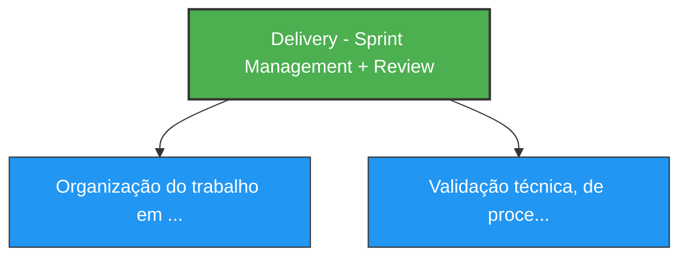
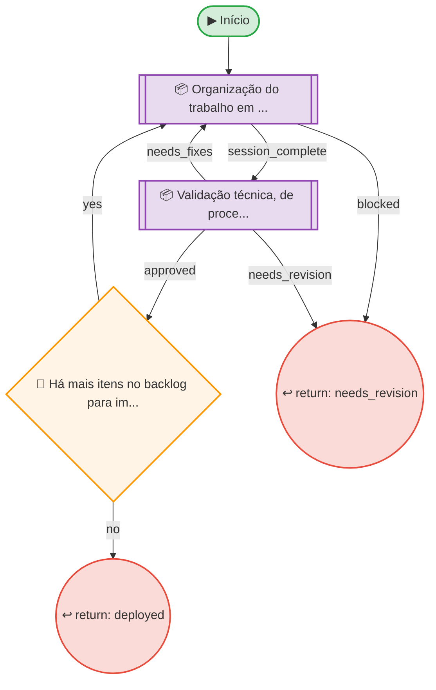
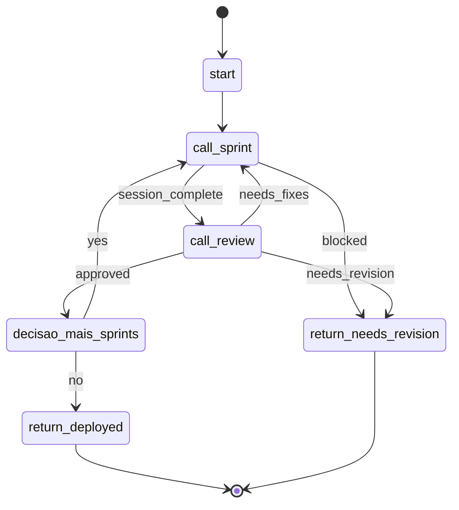

# Resumo do Processo

**ID:** `delivery`
**Versão:** 1.0.0
**Título:** Delivery - Sprint Management + Review
**Tipo:** Subprocesso

**Descrição:**
> Macro-processo que organiza trabalho em sprints, conduz cerimônias de review e conecta incrementos às entregas.

## Subprocessos

| ID | Descrição | Retornos Esperados |
|----|-----------|-------------------|
| `sprint` | Organização do trabalho em sprints e sessões | session_complete, blocked |
| `review` | Validação técnica, de processo e de negócio | approved, needs_fixes, needs_revision |

## Fases

| Fase | Nome | Passos | Subprocesso |
|------|------|--------|-------------|
| `delivery_overview` | Delivery Overview | 1 | - |

## Fluxo

**Total de nós:** 6

| Tipo | Quantidade |
|------|------------|
| 📦 Chamada | 2 |
| 🔀 Decisão | 1 |
| ↩ Retorno | 2 |
| ▶ Início | 1 |

**Decisões:**
- 🤖 Automáticas: 1

---

## Hierarquia de Processos

---

## Diagrama de Fluxo

---

## Diagrama de Estados

