# Resumo do Processo

**ID:** `delivery`
**Versão:** 1.0.0
**Título:** Delivery - Sprint Management + Review
**Tipo:** Subprocesso

**Descrição:**
> Macro-processo que organiza trabalho em sprints, conduz cerimônias de review e conecta incrementos às entregas.

## Subprocessos

| ID | Descrição | Retornos Esperados |
|----|-----------|-------------------|
| `sprint` | Organização do trabalho em sprints e sessões | session_complete, blocked |
| `review` | Validação técnica, de processo e de negócio | approved, needs_fixes, needs_revision |

## Fases

| Fase | Nome | Passos | Subprocesso |
|------|------|--------|-------------|
| `delivery_overview` | Delivery Overview | 1 | - |

## Fluxo

**Total de nós:** 6

| Tipo | Quantidade |
|------|------------|
| 📦 Chamada | 2 |
| 🔀 Decisão | 1 |
| ↩ Retorno | 2 |
| ▶ Início | 1 |

**Decisões:**
- 🤖 Automáticas: 1

---

## Hierarquia de Processos

```mermaid
flowchart TB
    delivery["Delivery - Sprint Management + Review"]

    sprint["Organização do trabalho em ..."]
    delivery --> sprint
    review["Validação técnica, de proce..."]
    delivery --> review

    classDef main fill:#4CAF50,stroke:#333,stroke-width:2px,color:#fff
    classDef sub fill:#2196F3,stroke:#333,stroke-width:1px,color:#fff
    class delivery main
    class sprint,review sub
```

---

## Diagrama de Fluxo

```mermaid
flowchart TD
    start(["▶ Início"])
    call_sprint[["📦 Organização do trabalho em ..."]]
    call_review[["📦 Validação técnica, de proce..."]]
    decisao_mais_sprints{"🤖 Há mais itens no backlog para im..."}
    return_deployed(("↩ return: deployed"))
    return_needs_revision(("↩ return: needs_revision"))

    start --> call_sprint
    call_sprint -->|"session_complete"| call_review
    call_sprint -->|"blocked"| return_needs_revision
    call_review -->|"approved"| decisao_mais_sprints
    call_review -->|"needs_fixes"| call_sprint
    call_review -->|"needs_revision"| return_needs_revision
    decisao_mais_sprints -->|"yes"| call_sprint
    decisao_mais_sprints -->|"no"| return_deployed

    %% Estilos
    classDef startEnd fill:#d4edda,stroke:#28a745,stroke-width:2px
    classDef stepNode fill:#e1f5ff,stroke:#333,stroke-width:1px
    classDef decisionNode fill:#fff4e6,stroke:#ff9800,stroke-width:2px
    classDef subprocessCall fill:#e8daef,stroke:#8e44ad,stroke-width:2px
    classDef returnNode fill:#fadbd8,stroke:#e74c3c,stroke-width:2px
    class start startEnd
    class decisao_mais_sprints decisionNode
    class call_sprint,call_review subprocessCall
    class return_deployed,return_needs_revision returnNode
```

---

## Diagrama de Estados

