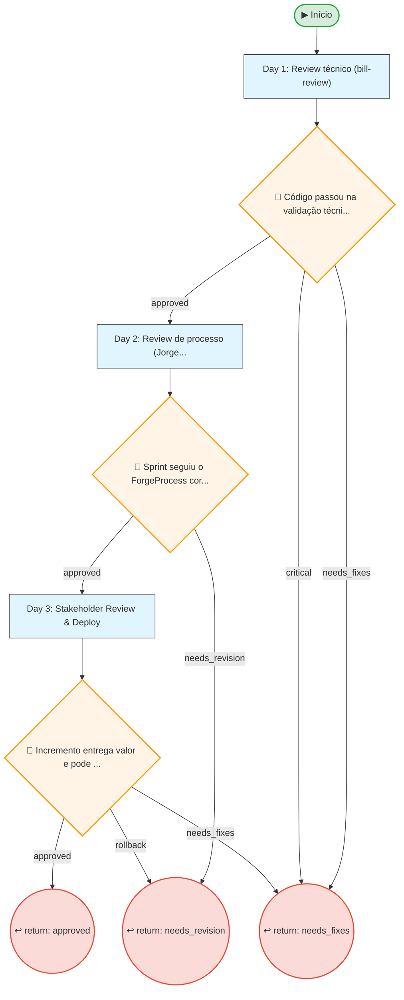
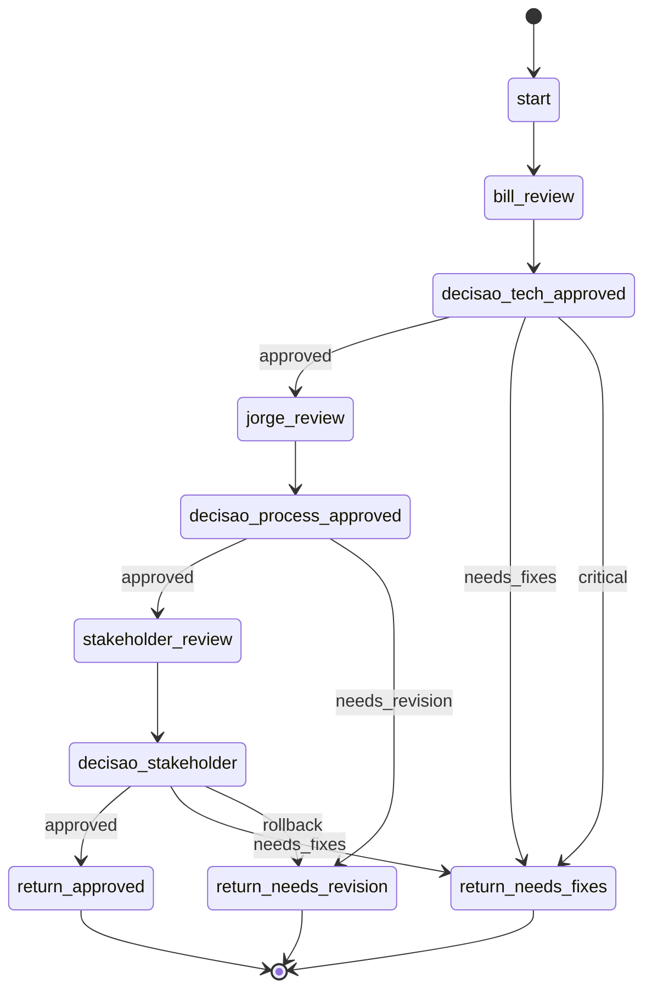

# Resumo do Processo

**ID:** `review`
**Versão:** 1.0.0
**Título:** Review & Feedback
**Tipo:** Subprocesso

**Descrição:**
> Validação técnica, de processo e de negócio antes de consolidar a entrega. Inclui bill-review (técnico), Jorge the Forge (processo) e Stakeholder Review.

## Fases

| Fase | Nome | Passos | Subprocesso |
|------|------|--------|-------------|
| `review_cycle` | Review Cycle | 3 | - |

## Fluxo

**Total de nós:** 10

| Tipo | Quantidade |
|------|------------|
| 🔀 Decisão | 3 |
| ↩ Retorno | 3 |
| ▶ Início | 1 |
| 📋 Passo | 3 |

**Decisões:**
- 👤 HIL (humanas): 1
- 🤖 Automáticas: 2

---

## Diagrama de Fluxo

---

## Diagrama de Estados

