# Resumo do Processo

**ID:** `review`
**Versão:** 1.0.0
**Título:** Review & Feedback
**Tipo:** Subprocesso

**Descrição:**
> Validação técnica, de processo e de negócio antes de consolidar a entrega. Inclui bill-review (técnico), Jorge the Forge (processo) e Stakeholder Review.

## Fases

| Fase | Nome | Passos | Subprocesso |
|------|------|--------|-------------|
| `review_cycle` | Review Cycle | 3 | - |

## Fluxo

**Total de nós:** 10

| Tipo | Quantidade |
|------|------------|
| 🔀 Decisão | 3 |
| ↩ Retorno | 3 |
| ▶ Início | 1 |
| 📋 Passo | 3 |

**Decisões:**
- 👤 HIL (humanas): 1
- 🤖 Automáticas: 2

---

## Diagrama de Fluxo

```mermaid
flowchart TD
    start(["▶ Início"])
    bill_review["Day 1: Review técnico (bill-review)"]
    decisao_tech_approved{"🤖 Código passou na validação técni..."}
    jorge_review["Day 2: Review de processo (Jorge..."]
    decisao_process_approved{"🤖 Sprint seguiu o ForgeProcess cor..."}
    stakeholder_review["Day 3: Stakeholder Review & Deploy"]
    decisao_stakeholder{"👤 Incremento entrega valor e pode ..."}
    return_approved(("↩ return: approved"))
    return_needs_fixes(("↩ return: needs_fixes"))
    return_needs_revision(("↩ return: needs_revision"))

    start --> bill_review
    bill_review --> decisao_tech_approved
    decisao_tech_approved -->|"approved"| jorge_review
    decisao_tech_approved -->|"needs_fixes"| return_needs_fixes
    decisao_tech_approved -->|"critical"| return_needs_fixes
    jorge_review --> decisao_process_approved
    decisao_process_approved -->|"approved"| stakeholder_review
    decisao_process_approved -->|"needs_revision"| return_needs_revision
    stakeholder_review --> decisao_stakeholder
    decisao_stakeholder -->|"approved"| return_approved
    decisao_stakeholder -->|"needs_fixes"| return_needs_fixes
    decisao_stakeholder -->|"rollback"| return_needs_revision

    %% Estilos
    classDef startEnd fill:#d4edda,stroke:#28a745,stroke-width:2px
    classDef stepNode fill:#e1f5ff,stroke:#333,stroke-width:1px
    classDef decisionNode fill:#fff4e6,stroke:#ff9800,stroke-width:2px
    classDef subprocessCall fill:#e8daef,stroke:#8e44ad,stroke-width:2px
    classDef returnNode fill:#fadbd8,stroke:#e74c3c,stroke-width:2px
    class start startEnd
    class bill_review,jorge_review,stakeholder_review stepNode
    class decisao_tech_approved,decisao_process_approved,decisao_stakeholder decisionNode
    class return_approved,return_needs_fixes,return_needs_revision returnNode
```

---

## Diagrama de Estados

