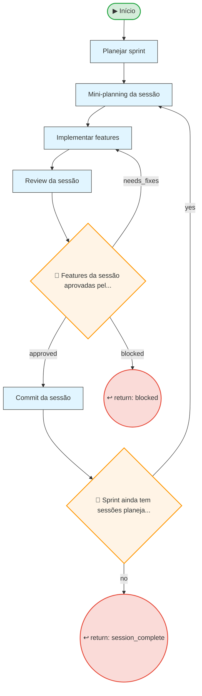
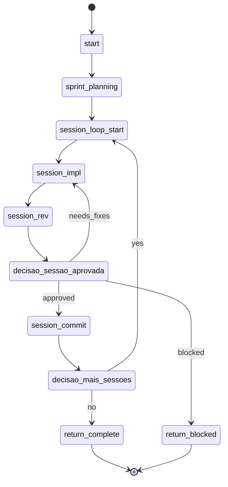

# Resumo do Processo

**ID:** `sprint`
**Versão:** 1.0.0
**Título:** Sprint - Session-Based Development
**Tipo:** Subprocesso

**Descrição:**
> Organização do trabalho em sprints e sessões, adaptado para agent coders com modelo session-based.

## Fases

| Fase | Nome | Passos | Subprocesso |
|------|------|--------|-------------|
| `sprint_cycle` | Sprint Cycle | 5 | - |

## Fluxo

**Total de nós:** 10

| Tipo | Quantidade |
|------|------------|
| 🔀 Decisão | 2 |
| ↩ Retorno | 2 |
| ▶ Início | 1 |
| 📋 Passo | 5 |

**Decisões:**
- 👤 HIL (humanas): 1
- 🤖 Automáticas: 1

---

## Diagrama de Fluxo

---

## Diagrama de Estados

