# Resumo do Processo

**ID:** `sprint`
**Versão:** 1.0.0
**Título:** Sprint - Session-Based Development
**Tipo:** Subprocesso

**Descrição:**
> Organização do trabalho em sprints e sessões, adaptado para agent coders com modelo session-based.

## Fases

| Fase | Nome | Passos | Subprocesso |
|------|------|--------|-------------|
| `sprint_cycle` | Sprint Cycle | 5 | - |

## Fluxo

**Total de nós:** 10

| Tipo | Quantidade |
|------|------------|
| 🔀 Decisão | 2 |
| ↩ Retorno | 2 |
| ▶ Início | 1 |
| 📋 Passo | 5 |

**Decisões:**
- 👤 HIL (humanas): 1
- 🤖 Automáticas: 1

---

## Diagrama de Fluxo

```mermaid
flowchart TD
    start(["▶ Início"])
    sprint_planning["Planejar sprint"]
    session_loop_start["Mini-planning da sessão"]
    session_impl["Implementar features"]
    session_rev["Review da sessão"]
    decisao_sessao_aprovada{"👤 Features da sessão aprovadas pel..."}
    session_commit["Commit da sessão"]
    decisao_mais_sessoes{"🤖 Sprint ainda tem sessões planeja..."}
    return_complete(("↩ return: session_complete"))
    return_blocked(("↩ return: blocked"))

    start --> sprint_planning
    sprint_planning --> session_loop_start
    session_loop_start --> session_impl
    session_impl --> session_rev
    session_rev --> decisao_sessao_aprovada
    decisao_sessao_aprovada -->|"approved"| session_commit
    decisao_sessao_aprovada -->|"needs_fixes"| session_impl
    decisao_sessao_aprovada -->|"blocked"| return_blocked
    session_commit --> decisao_mais_sessoes
    decisao_mais_sessoes -->|"yes"| session_loop_start
    decisao_mais_sessoes -->|"no"| return_complete

    %% Estilos
    classDef startEnd fill:#d4edda,stroke:#28a745,stroke-width:2px
    classDef stepNode fill:#e1f5ff,stroke:#333,stroke-width:1px
    classDef decisionNode fill:#fff4e6,stroke:#ff9800,stroke-width:2px
    classDef subprocessCall fill:#e8daef,stroke:#8e44ad,stroke-width:2px
    classDef returnNode fill:#fadbd8,stroke:#e74c3c,stroke-width:2px
    class start startEnd
    class sprint_planning,session_loop_start,session_impl,session_rev,session_commit stepNode
    class decisao_sessao_aprovada,decisao_mais_sessoes decisionNode
    class return_complete,return_blocked returnNode
```

---

## Diagrama de Estados

