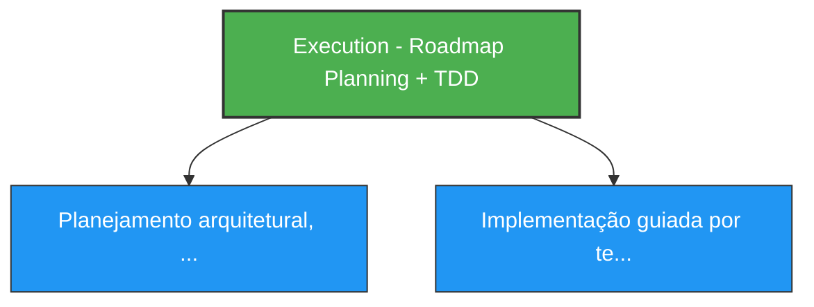
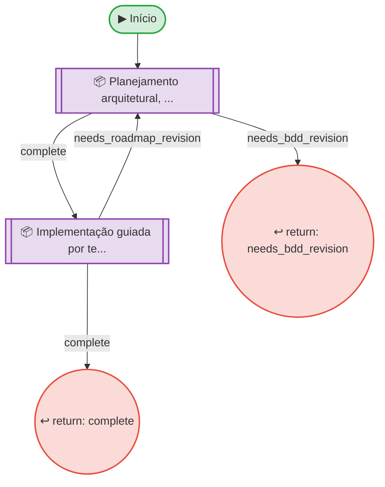
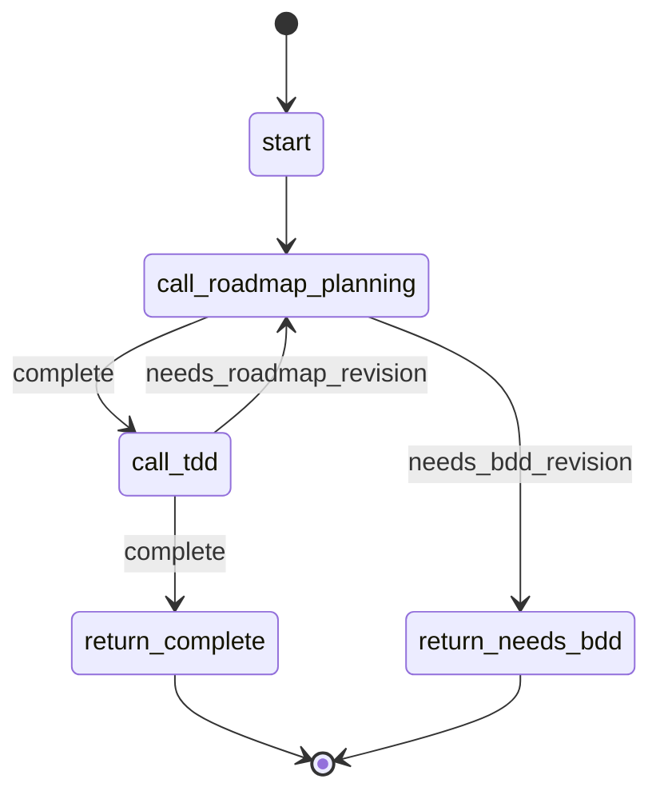

# Resumo do Processo

**ID:** `execution`
**Versão:** 1.0.0
**Título:** Execution - Roadmap Planning + TDD
**Tipo:** Subprocesso

**Descrição:**
> Macro-processo que conecta especificação BDD com backlog técnico e código testado, orquestrando Roadmap Planning e TDD Workflow.

## Subprocessos

| ID | Descrição | Retornos Esperados |
|----|-----------|-------------------|
| `roadmap_planning` | Planejamento arquitetural, sequenciamento e criação de backlog | complete, needs_bdd_revision |
| `tdd` | Implementação guiada por testes (Red-Green-Refactor) | complete, needs_roadmap_revision |

## Fases

| Fase | Nome | Passos | Subprocesso |
|------|------|--------|-------------|
| `execution_overview` | Execution Overview | 1 | - |

## Fluxo

**Total de nós:** 5

| Tipo | Quantidade |
|------|------------|
| 📦 Chamada | 2 |
| ↩ Retorno | 2 |
| ▶ Início | 1 |

---

## Hierarquia de Processos

---

## Diagrama de Fluxo

---

## Diagrama de Estados

