# Resumo do Processo

**ID:** `execution`
**Versão:** 1.0.0
**Título:** Execution - Roadmap Planning + TDD
**Tipo:** Subprocesso

**Descrição:**
> Macro-processo que conecta especificação BDD com backlog técnico e código testado, orquestrando Roadmap Planning e TDD Workflow.

## Subprocessos

| ID | Descrição | Retornos Esperados |
|----|-----------|-------------------|
| `roadmap_planning` | Planejamento arquitetural, sequenciamento e criação de backlog | complete, needs_bdd_revision |
| `tdd` | Implementação guiada por testes (Red-Green-Refactor) | complete, needs_roadmap_revision |

## Fases

| Fase | Nome | Passos | Subprocesso |
|------|------|--------|-------------|
| `execution_overview` | Execution Overview | 1 | - |

## Fluxo

**Total de nós:** 5

| Tipo | Quantidade |
|------|------------|
| 📦 Chamada | 2 |
| ↩ Retorno | 2 |
| ▶ Início | 1 |

---

## Hierarquia de Processos

---

## Diagrama de Fluxo

```mermaid
flowchart TD
    start(["▶ Início"])
    call_roadmap_planning[["📦 Planejamento arquitetural, ..."]]
    call_tdd[["📦 Implementação guiada por te..."]]
    return_complete(("↩ return: complete"))
    return_needs_bdd(("↩ return: needs_bdd_revision"))

    start --> call_roadmap_planning
    call_roadmap_planning -->|"complete"| call_tdd
    call_roadmap_planning -->|"needs_bdd_revision"| return_needs_bdd
    call_tdd -->|"complete"| return_complete
    call_tdd -->|"needs_roadmap_revision"| call_roadmap_planning

    %% Estilos
    classDef startEnd fill:#d4edda,stroke:#28a745,stroke-width:2px
    classDef stepNode fill:#e1f5ff,stroke:#333,stroke-width:1px
    classDef decisionNode fill:#fff4e6,stroke:#ff9800,stroke-width:2px
    classDef subprocessCall fill:#e8daef,stroke:#8e44ad,stroke-width:2px
    classDef returnNode fill:#fadbd8,stroke:#e74c3c,stroke-width:2px
    class start startEnd
    class call_roadmap_planning,call_tdd subprocessCall
    class return_complete,return_needs_bdd returnNode
```

---

## Diagrama de Estados

