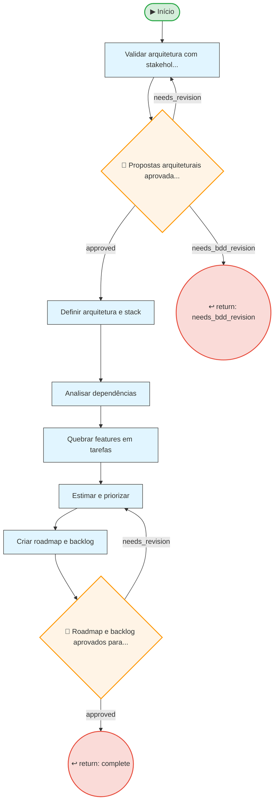
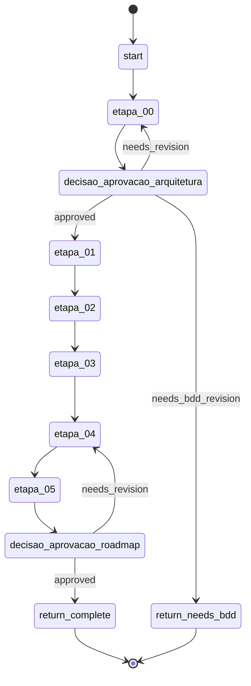

# Resumo do Processo

**ID:** `roadmap_planning`
**Versão:** 1.0.0
**Título:** Roadmap Planning
**Tipo:** Subprocesso

**Descrição:**
> Fase de planejamento executivo que transforma features Gherkin em backlog sequencial e executável.

## Fases

| Fase | Nome | Passos | Subprocesso |
|------|------|--------|-------------|
| `planning_main` | Roadmap Planning | 6 | - |

## Fluxo

**Total de nós:** 11

| Tipo | Quantidade |
|------|------------|
| 🔀 Decisão | 2 |
| ↩ Retorno | 2 |
| ▶ Início | 1 |
| 📋 Passo | 6 |

**Decisões:**
- 👤 HIL (humanas): 2

---

## Diagrama de Fluxo

---

## Diagrama de Estados

