# Resumo do Processo

**ID:** `roadmap_planning`
**Versão:** 1.0.0
**Título:** Roadmap Planning
**Tipo:** Subprocesso

**Descrição:**
> Fase de planejamento executivo que transforma features Gherkin em backlog sequencial e executável.

## Fases

| Fase | Nome | Passos | Subprocesso |
|------|------|--------|-------------|
| `planning_main` | Roadmap Planning | 6 | - |

## Fluxo

**Total de nós:** 11

| Tipo | Quantidade |
|------|------------|
| 🔀 Decisão | 2 |
| ↩ Retorno | 2 |
| ▶ Início | 1 |
| 📋 Passo | 6 |

**Decisões:**
- 👤 HIL (humanas): 2

---

## Diagrama de Fluxo

```mermaid
flowchart TD
    start(["▶ Início"])
    etapa_00["Validar arquitetura com stakehol..."]
    decisao_aprovacao_arquitetura{"👤 Propostas arquiteturais aprovada..."}
    etapa_01["Definir arquitetura e stack"]
    etapa_02["Analisar dependências"]
    etapa_03["Quebrar features em tarefas"]
    etapa_04["Estimar e priorizar"]
    etapa_05["Criar roadmap e backlog"]
    decisao_aprovacao_roadmap{"👤 Roadmap e backlog aprovados para..."}
    return_complete(("↩ return: complete"))
    return_needs_bdd(("↩ return: needs_bdd_revision"))

    start --> etapa_00
    etapa_00 --> decisao_aprovacao_arquitetura
    decisao_aprovacao_arquitetura -->|"approved"| etapa_01
    decisao_aprovacao_arquitetura -->|"needs_revision"| etapa_00
    decisao_aprovacao_arquitetura -->|"needs_bdd_revision"| return_needs_bdd
    etapa_01 --> etapa_02
    etapa_02 --> etapa_03
    etapa_03 --> etapa_04
    etapa_04 --> etapa_05
    etapa_05 --> decisao_aprovacao_roadmap
    decisao_aprovacao_roadmap -->|"approved"| return_complete
    decisao_aprovacao_roadmap -->|"needs_revision"| etapa_04

    %% Estilos
    classDef startEnd fill:#d4edda,stroke:#28a745,stroke-width:2px
    classDef stepNode fill:#e1f5ff,stroke:#333,stroke-width:1px
    classDef decisionNode fill:#fff4e6,stroke:#ff9800,stroke-width:2px
    classDef subprocessCall fill:#e8daef,stroke:#8e44ad,stroke-width:2px
    classDef returnNode fill:#fadbd8,stroke:#e74c3c,stroke-width:2px
    class start startEnd
    class etapa_00,etapa_01,etapa_02,etapa_03,etapa_04,etapa_05 stepNode
    class decisao_aprovacao_arquitetura,decisao_aprovacao_roadmap decisionNode
    class return_complete,return_needs_bdd returnNode
```

---

## Diagrama de Estados

