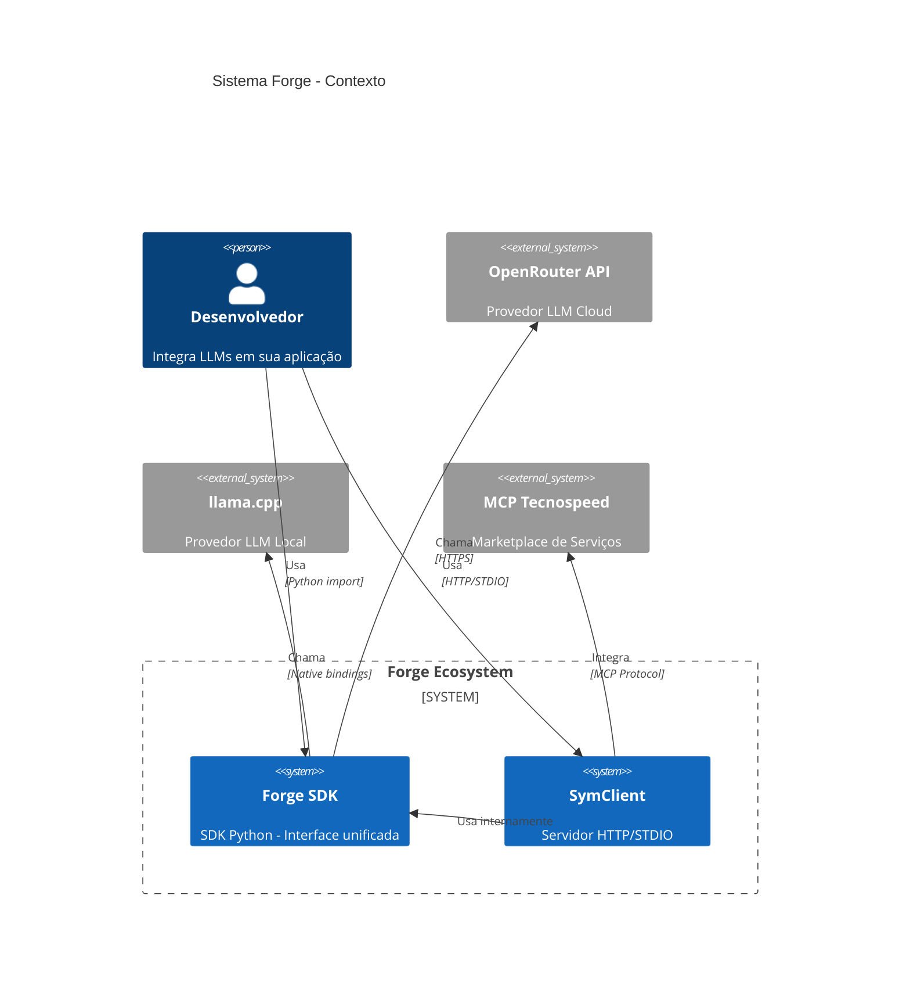
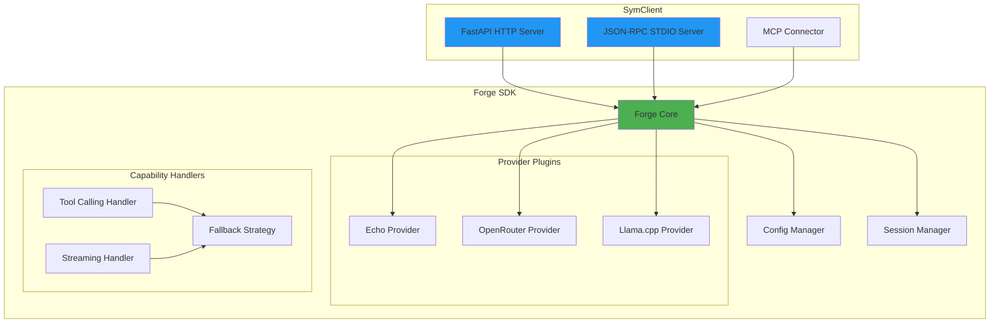
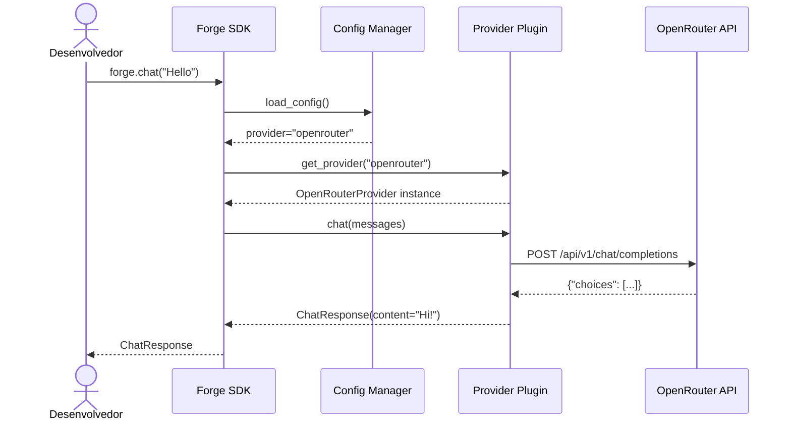
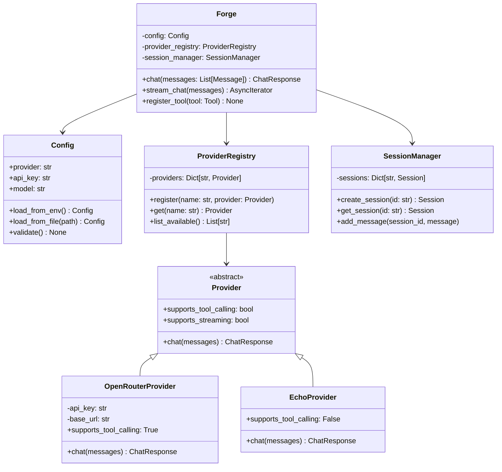
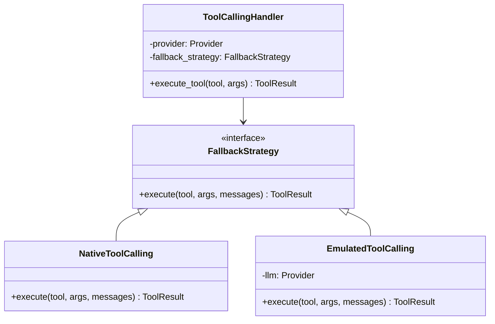
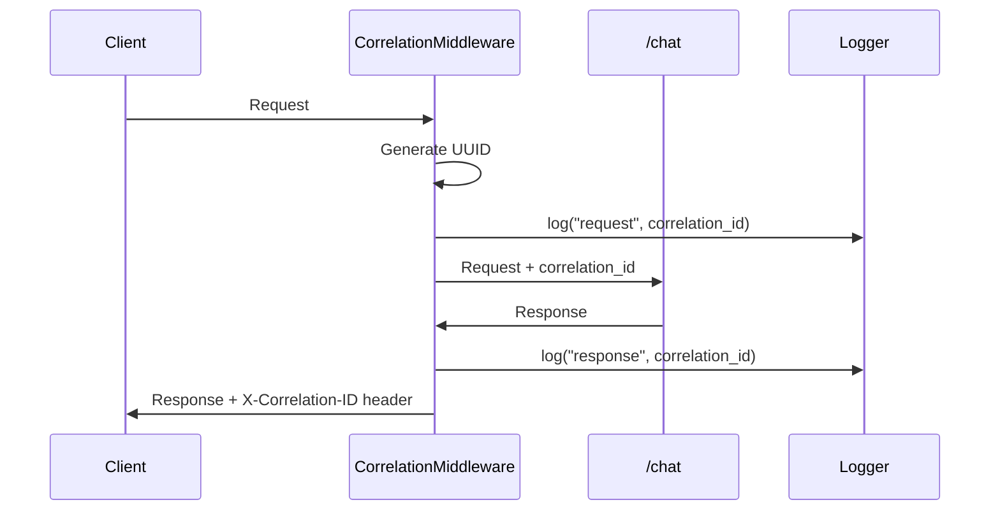
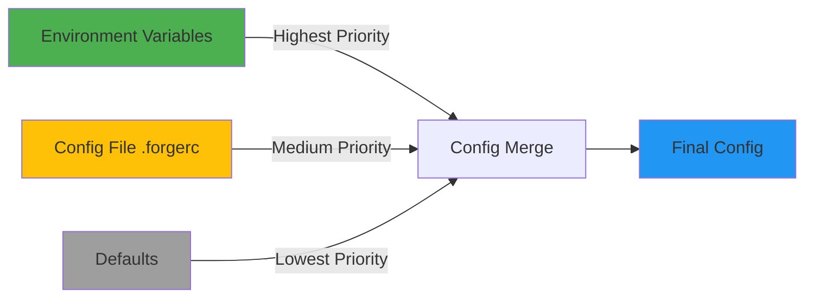
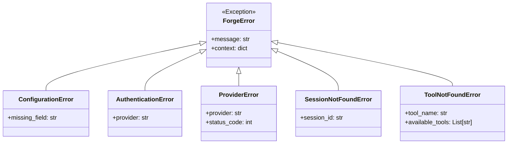
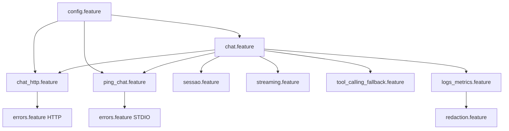

# 🗺️ Roadmap Planning Process

**Subprocesso do Execution Process – da especificação (BDD) ao backlog executável.**

---

## 🌟 Visão Geral

O **Roadmap Planning** é a fase de planejamento executivo que transforma features Gherkin em um backlog sequencial e executável. Ele é a **primeira subetapa** do
`process/execution/PROCESS.md` e responde:

- **QUANDO** cada feature será implementada?
- **EM QUE ORDEM** as tarefas devem ser executadas?
- **QUANTO ESFORÇO** cada item demanda?
- **QUEM** é responsável por cada track?
- **COMO** medir progresso?

```
BDD (O QUÊ fazer) → ROADMAP PLANNING (QUANDO/COMO) → TDD (Implementar)
     ↓                         ↓                            ↓
project/specs/bdd/*.feature      ROADMAP.md + BACKLOG         forge/* código
"Comportamento"          "Planejamento"               "Implementação"
```

---

## 🎯 Propósito do Roadmap Planning

**Não é** sobre tecnologia. **É** sobre:
- Sequenciar features por dependência e valor
- Quebrar features complexas em tarefas menores
- Estimar esforço e alocar recursos
- Criar backlog vivo que evolui durante TDD
- Dar visibilidade de progresso para stakeholders

**Entrada**: Features BDD prontas (Etapa 6 completa)
**Saída**: Roadmap executável + Backlog priorizado

---

## 📖 As Sete Subetapas do Roadmap Planning

```
┌─────────────────────────────────────────────────────────┐
│ 0. Validação Arquitetural com Stakeholders ⭐         │
│    "Apresentar propostas e obter aprovação"            │
└────────────────┬────────────────────────────────────────┘
                 │ Alinhamento e Aprovação
                 ▼
┌─────────────────────────────────────────────────────────┐
│ 1. Definição Arquitetural e Stack (ADR)               │
│    "Decisões técnicas fundamentais APROVADAS"          │
└────────────────┬────────────────────────────────────────┘
                 │ Fundação Técnica
                 ▼
┌─────────────────────────────────────────────────────────┐
│ 2. Análise de Dependências                            │
│    "Identificar ordem técnica obrigatória"             │
└────────────────┬────────────────────────────────────────┘
                 │ Mapeamento: Feature → Dependências
                 ▼
┌─────────────────────────────────────────────────────────┐
│ 3. Quebra de Features (Feature Breakdown)             │
│    "Dividir features grandes em tarefas menores"       │
└────────────────┬────────────────────────────────────────┘
                 │ Granularização
                 ▼
┌─────────────────────────────────────────────────────────┐
│ 4. Estimativa e Priorização                           │
│    "Estimar esforço e ordenar por valor/dependência"   │
└────────────────┬────────────────────────────────────────┘
                 │ Planejamento
                 ▼
┌─────────────────────────────────────────────────────────┐
│ 5. Criação do Roadmap e Backlog                       │
│    "Gerar documentos executáveis (ROADMAP + BACKLOG)"  │
└────────────────┬────────────────────────────────────────┘
                 │ Documentação Operacional
                 ▼
┌─────────────────────────────────────────────────────────┐
│ 6. Planejamento de Ciclos ⭐ NOVO                     │
│    "Alocar ValueTracks em ciclos — visão do todo"      │
└─────────────────────────────────────────────────────────┘
```

## 🔖 IDs das Subetapas (para agentes/LLMs)

Para orquestração automática, as subetapas deste processo usam os seguintes IDs:

- `execution.roadmap.00.validacao_stakeholder` — **0. Validação Arquitetural com Stakeholders**
- `execution.roadmap.01.definicao_stack_adr` — **1. Definição Arquitetural e Stack (ADR)**
- `execution.roadmap.02.analise_dependencias` — **2. Análise de Dependências**
- `execution.roadmap.03.quebra_features` — **3. Quebra de Features (Feature Breakdown)**
- `execution.roadmap.04.estimativa_priorizacao` — **4. Estimativa e Priorização**
- `execution.roadmap.05.roadmap_backlog` — **5. Criação do Roadmap e Backlog**
- `execution.roadmap.06.cycle_planning` — **6. Planejamento de Ciclos** ⭐ NOVO

---

## 🗂️ Estrutura de Saída Esperada

> **Estrutura alvo em projetos ForgeProcess**
> Os caminhos abaixo representam a organização **esperada** em um projeto real que adota o ForgeProcess.
> Este repositório não contém `project/specs/roadmap` nem outros diretórios de código; eles serão criados
> por ferramentas como `symforge init -p forgeprocess myproject` ou por scaffolding equivalente.

Ao final do Roadmap Planning, um projeto típico terá:

```
project/specs/
 └── roadmap/
      ├── TECH_STACK.md           ← Stack completo (libs, versões, ferramentas)
      ├── ADR.md                  ← Índice de Architecture Decision Records
      ├── adr/                    ← ADRs individuais
      │   ├── ADR-001.md         (Framework HTTP)
      │   ├── ADR-002.md         (Plugin Architecture)
      │   └── ADR-00N.md         (etc)
      ├── HLD.md                  ← High Level Design (arquitetura macro)
      ├── LLD.md                  ← Low Level Design (classes, fluxos)
      ├── ROADMAP.md              ← Visão executiva (fases, marcos, datas)
      ├── BACKLOG.md              ← Backlog detalhado (tarefas priorizadas)
      ├── dependency_graph.md     ← Grafo de dependências (Mermaid)
      ├── estimates.yml           ← Estimativas de esforço por feature
      └── CYCLE_PLAN.md           ← Alocação de ValueTracks em ciclos ⭐ NOVO
```

---

## 🔹 Subetapa 0: Validação Arquitetural com Stakeholders ⭐ NOVA

### Objetivo
**Apresentar propostas técnicas e obter validação/aprovação ANTES de tomar decisões definitivas.**

> Symbiota de arquitetura responsável: **Mark Arc**
> Papel: conduzir a análise arquitetural ForgeBase (Clean/Hex, CLI-first, observability-first),
> preparar propostas técnicas e apoiar stakeholder/tech lead nas decisões.

### Por que esta subetapa é crítica?

❌ **Problema comum**: Equipe técnica toma decisões arquiteturais sem consultar stakeholders, resultando em:
- Retrabalho custoso quando stakeholders discordam
- Decisões que não alinham com restrições de negócio (budget, prazos, skills do time)
- Falta de buy-in dos stakeholders

✅ **Solução**: Criar questionário de validação arquitetural para apresentar **propostas fundamentadas** e obter aprovação.

### Processo

#### 0.1 Análise Preparatória (Mark Arc — symbiota de arquitetura ForgeBase)

Antes de perguntar ao stakeholder, o symbiota **mark_arc** deve:
1. Analisar `project/docs/visao.md` (problema, solução, métricas)
2. Revisar `project/specs/bdd/*.feature` (casos de uso técnicos)
3. Revisar `project/specs/bdd/tracks.yml` (ValueTracks e métricas)
4. Identificar constraints técnicos (BDD já definiu comportamentos esperados)

#### 0.2 Esboçar Propostas Técnicas

Com base na análise, o symbiota **mark_arc** esboça propostas para:
- **Stack tecnológico** (linguagem, frameworks, libs principais)
- **Arquitetura macro** (monolito, microserviços, plugins, etc)
- **Modelo de concorrência** (sync, async, threads, etc)
- **Infraestrutura** (cloud, on-premise, containers, etc)
- **Estratégia de deployment** (Docker, K8s, serverless, etc)

**Formato das propostas**: Para cada decisão, apresentar 2-3 alternativas com trade-offs claros.

#### 0.3 Criar Questionário de Validação

**Criar**: `project/specs/roadmap/ARCHITECTURAL_QUESTIONNAIRE.md`

O questionário deve conter:
- **Proposta principal** (recomendação do symbiota mark_arc)
- **Alternativas consideradas** (com prós/contras)
- **Perguntas de validação** (para stakeholder responder)
- **Trade-offs explícitos** (custo vs. performance, simplicidade vs. flexibilidade, etc)

#### 0.4 Apresentar ao Stakeholder

**Formato sugerido**:
```markdown
## Decisão 1: Stack Backend

### Proposta Principal (Recomendada)
**Python 3.11+ com FastAPI**

**Por quê?**
- Requisito explícito: "módulo Python instalável via pip"
- FastAPI: async nativo, OpenAPI automático, validação Pydantic
- Ecossistema ML/LLM maduro em Python

**Trade-offs**:
- ✅ Prós: Rápido para MVP, ótima DX, type-safe
- ❌ Contras: Performance inferior a Go/Rust, GIL pode limitar concorrência CPU-bound

### Alternativas Consideradas

#### Alt 1: Node.js + Express
- ✅ Prós: Async nativo, npm ecosystem, performance excelente I/O
- ❌ Contras: Não atende requisito "módulo Python", menos natural para ML

#### Alt 2: Go + net/http
- ✅ Prós: Performance, concorrência nativa (goroutines)
- ❌ Contras: Não atende requisito "módulo Python", curva aprendizado

### ❓ Perguntas para Stakeholder

1. **Confirma requisito**: O SDK DEVE ser Python? Ou pode ser language-agnostic desde o início?
   - [ ] Sim, DEVE ser Python (conforme visao.md)
   - [ ] Podemos reconsiderar outra linguagem

2. **Performance vs. Simplicidade**: Você prioriza:
   - [ ] Simplicidade/velocidade de desenvolvimento (Python)
   - [ ] Performance máxima (Go/Rust)
   - [ ] Ambos igualmente (explicar trade-off)

3. **Skills do time**: Time atual tem experiência em:
   - [ ] Python (pronto para começar)
   - [ ] Outra linguagem (especificar)
```

#### 0.5 Aguardar Aprovação

**IMPORTANTE**: **NÃO PROSSEGUIR** para Subetapa 1 sem aprovação explícita do stakeholder!

Aguardar respostas no questionário. Stakeholder pode:
- ✅ Aprovar proposta
- 🔄 Solicitar ajustes
- ❌ Rejeitar e propor alternativa

#### 0.6 Consolidar Decisões Aprovadas

Após aprovação, criar `project/specs/roadmap/ARCHITECTURAL_DECISIONS_APPROVED.md` com:
- Decisões aprovadas pelo stakeholder
- Data de aprovação
- Nome do stakeholder aprovador
- Justificativas finais

**Somente após este documento criado**, prosseguir para Subetapa 1.

---

## 🔹 Subetapa 1: Definição Arquitetural e Stack (ADR)

### Objetivo
**Documentar decisões técnicas APROVADAS** na Subetapa 0 em formato ADR (Architecture Decision Record).

### Por que ADR (Architecture Decision Records)?
- **Rastreabilidade**: Por QUE escolhemos X ao invés de Y?
- **Onboarding**: Novos desenvolvedores entendem decisões passadas
- **Evita debates repetidos**: Decisão já foi tomada e documentada
- **Accountability**: Quem decidiu, quando, com base em quê?

### Processo

#### 1.1 Definir Stack Tecnológico

**Perguntas a responder**:
- Qual versão do Python? (3.11+, 3.12+?)
- Quais bibliotecas core? (httpx, pydantic, pytest-bdd, etc)
- Qual framework HTTP? (FastAPI, Flask, Starlette?)
- Qual biblioteca para STDIO/JSON-RPC? (Custom, python-jsonrpc?)
- Como gerenciar dependências? (poetry, pip-tools, uv?)
- Qual ferramenta de build? (setuptools, hatch, flit?)
- Type checking? (mypy, pyright?)
- Linting? (ruff, pylint, flake8?)
- Formatação? (black, ruff format?)

**Criar**: `project/specs/roadmap/TECH_STACK.md`

> **Recomendação específica para projetos ForgeBase**
>
> Para runtimes e módulos que se apoiam no ForgeBase (como o forgeCodeAgent),
> esta subetapa também deve registrar a versão alvo do pacote `forgebase` e
> garantir que o núcleo esteja instalado e importável no ambiente de
> desenvolvimento (ver `docs/integrations/forgebase_guides/forgebase_install.md`).
> Isso evita que a fase de TDD seja iniciada sem as bases `EntityBase`,
> `UseCaseBase`, `PortBase` e `AdapterBase` disponíveis.

> **Ambiente de testes e pre-commit**
>
> Ainda nesta subetapa (ou logo ao final da 5.1.2), recomenda-se configurar:
> - virtualenv do projeto com dependências de desenvolvimento (pytest, pytest-bdd, pre-commit, ruff);
> - hooks de pre-commit conforme `temp/setup-git.txt` (copiando `pre-commit-config.yaml`, `ruff.toml`, scripts de instalação);
> - execução de um `pre-commit run --all-files` inicial para alinhar o baseline.
> Assim, quando o `forge_coder` entrar em execução na fase de TDD, o ambiente de testes e os guard-rails de qualidade já estarão prontos.

**Exemplo**:
```markdown
# Tech Stack — forgeLLMClient

## Python Core
- **Versão**: Python 3.11+ (3.12 recomendado)
- **Justificativa**: Type hints melhoradas, performance, suporte LTS

## Bibliotecas Principais

### SDK (Forge)
- **httpx** (0.27+): Cliente HTTP assíncrono para provedores cloud
- **pydantic** (2.0+): Validação de dados e schemas
- **typing-extensions**: Backport de tipos para 3.11

### Servidor (SymClient)
- **FastAPI** (0.110+): Framework HTTP com OpenAPI automático
- **uvicorn** (0.28+): ASGI server para produção
- **python-multipart**: Upload de arquivos (se necessário)

### JSON-RPC (STDIO)
- **jsonrpc-base** + custom wrapper: Protocolo STDIO
- **Justificativa**: Biblioteca leve, controle total do protocolo

### Testes
- **pytest** (8.0+): Framework de testes
- **pytest-bdd** (7.0+): Suporte a Gherkin
- **pytest-asyncio** (0.23+): Testes async
- **pytest-cov**: Cobertura de código

### Dev Tools
- **ruff** (0.3+): Linting + formatação (substitui black + flake8)
- **mypy** (1.9+): Type checking estático
- **pre-commit**: Git hooks
- **uv** ou **poetry**: Gerenciamento de dependências

## Estrutura de Projeto

```
forge/
├── pyproject.toml           # Configuração central (PEP 621)
├── src/
│   ├── forge/              # SDK Python
│   │   ├── __init__.py
│   │   ├── config.py
│   │   ├── chat.py
│   │   ├── providers/      # Plugins de provedores
│   │   └── utils/
│   └── symclient/          # Servidor HTTP/STDIO
│       ├── __init__.py
│       ├── http.py         # FastAPI app
│       └── stdio.py        # JSON-RPC handler
├── tests/
│   ├── bdd/                # Tests pytest-bdd
│   └── unit/               # Unit tests
└── project/specs/
    └── bdd/                # Features Gherkin
```

## Decisões Arquiteturais (ver ADR.md)
```

---

#### 1.2 Criar Architecture Decision Records (ADRs)

Para **cada decisão arquitetural importante**, criar um ADR seguindo formato padrão.

**Template ADR**:
```markdown
# ADR-001: [Título da Decisão]

**Status**: [Proposto | Aceito | Rejeitado | Superseded]
**Data**: AAAA-MM-DD
**Decisores**: [@tech-lead, @dev1, @dev2]

## Contexto

[Por que precisamos tomar essa decisão? Qual o problema?]

## Decisão

[O que decidimos fazer?]

## Alternativas Consideradas

1. **Opção A**: [Descrição]
   - ✅ Prós: ...
   - ❌ Contras: ...

2. **Opção B**: [Descrição] ← **ESCOLHIDA**
   - ✅ Prós: ...
   - ❌ Contras: ...

3. **Opção C**: [Descrição]
   - ✅ Prós: ...
   - ❌ Contras: ...

## Consequências

### Positivas
- [Benefício 1]
- [Benefício 2]

### Negativas
- [Trade-off 1]
- [Trade-off 2]

## Validação

Como saberemos se foi a decisão correta?
- [Critério 1]
- [Critério 2]

## Referências

- [Link para discussão no GitHub]
- [Documento técnico]
```

**Criar**: `project/specs/roadmap/ADR.md` (índice) + `project/specs/roadmap/adr/ADR-001.md`, `ADR-002.md`, etc.

---

### Exemplos de ADRs Necessários para Forge

#### ADR-001: Usar FastAPI para SymClient HTTP

**Contexto**: Precisamos expor Forge via HTTP. Opções: FastAPI, Flask, Django.

**Decisão**: Usar **FastAPI**

**Alternativas**:
- Flask: Mais simples, mas sem async nativo e OpenAPI manual
- Django: Muito pesado para servidor stateless
- **FastAPI**: Async nativo, OpenAPI automático, validação Pydantic

**Consequências**:
- ✅ OpenAPI docs automático (`/docs`)
- ✅ Async de primeira classe
- ✅ Validação de schemas via Pydantic
- ❌ Curva de aprendizado maior que Flask

---

#### ADR-002: Plugin Architecture para Provedores

**Contexto**: Múltiplos provedores (OpenRouter, llama.cpp, echo) com capacidades diferentes.

**Decisão**: Arquitetura de **plugins** com interface `Provider` base.

**Alternativas**:
- Hard-coded if/else: Não escalável
- **Plugin system com ABC**: Extensível, testável
- Biblioteca third-party: Dependência extra

**Consequências**:
- ✅ Fácil adicionar novos provedores
- ✅ Testes isolados por provider
- ✅ Fallback strategies isoladas
- ❌ Overhead inicial de abstração

**Interface**:
```python
class Provider(ABC):
    @abstractmethod
    async def chat(self, messages: list[Message]) -> ChatResponse:
        ...

    @property
    @abstractmethod
    def supports_tool_calling(self) -> bool:
        ...
```

---

#### ADR-003: Usar pytest-bdd para Automação BDD

**Contexto**: Features Gherkin existem. Precisamos automatizar.

**Decisão**: **pytest-bdd**

**Alternativas**:
- behave: Python puro, mas ecosistema menor
- **pytest-bdd**: Integra com pytest (já usamos)
- Robot Framework: Muito verboso

**Consequências**:
- ✅ Usa infraestrutura pytest existente
- ✅ Fixtures compartilhadas
- ✅ Plugins pytest (cov, asyncio, etc)
- ❌ Sintaxe decorators pode confundir iniciantes

---

#### ADR-004: Gerenciamento de Dependências com UV

**Contexto**: Escolher entre pip-tools, poetry, uv.

**Decisão**: **uv** (https://github.com/astral-sh/uv)

**Alternativas**:
- pip-tools: Funciona, mas lento
- poetry: Bom, mas reinventa wheels
- **uv**: Rápido (Rust), compatível com pip, futuro do Python

**Consequências**:
- ✅ 10-100x mais rápido que pip
- ✅ Lock file automático
- ✅ Compatível com requirements.txt
- ❌ Ferramenta nova (risco de bugs)

---

#### ADR-005: Estrutura Monorepo vs Multi-repo

**Contexto**: Forge (SDK) e SymClient (servidor) no mesmo repo ou separados?

**Decisão**: **Monorepo** (mesmo repositório)

**Alternativas**:
- Multi-repo: Versionamento independente
- **Monorepo**: Compartilha código, sincroniza versões

**Consequências**:
- ✅ Código compartilhado (types, utils)
- ✅ Testes integrados
- ✅ Versionamento sincronizado
- ❌ Releases acopladas

**Estrutura**:
```
src/
├── forge/          # SDK (publicado no PyPI)
└── symclient/      # Servidor (container/binary)
```

---

---

#### 1.3 Criar Diagramas de Arquitetura (HLD e LLD)

Decisões arquiteturais devem ser **visualizadas** para facilitar compreensão e comunicação.

### HLD (High Level Design) - Visão Macro

**Objetivo**: Mostrar componentes principais, integrações externas, fluxos de dados de alto nível.

**Criar**: `project/specs/roadmap/HLD.md`

**Exemplo para Forge**:

```markdown
# HLD — Forge & SymClient Architecture

## Componentes Principais



## Arquitetura de Plugins



## Fluxo de Dados - Chat Request



## Integrações Externas

| Componente | Protocolo | Autenticação | Observações |
|------------|-----------|--------------|-------------|
| OpenRouter API | HTTPS/REST | API Key (Bearer) | Rate limits aplicam |
| llama.cpp | Native C bindings | N/A | Execução local |
| MCP Tecnospeed | MCP Protocol | OAuth 2.0 | Staging + Prod |
| LLM Broker | HTTPS/REST | JWT | Roteamento inteligente |
```

**Elementos de um bom HLD**:
- ✅ Diagrama C4 Context (contexto geral)
- ✅ Diagrama de componentes (módulos principais)
- ✅ Diagrama de sequência (fluxos principais)
- ✅ Integrações externas (protocolos, auth)
- ✅ Decisões arquiteturais resumidas

---

### LLD (Low Level Design) - Visão Detalhada

**Objetivo**: Mostrar estrutura interna de módulos, classes, interfaces, padrões de design.

**Criar**: `project/specs/roadmap/LLD.md`

**Exemplo para Forge**:

```markdown
# LLD — Forge & SymClient Detailed Design

## Módulo: Forge SDK Core

### Estrutura de Classes



### Interface: Provider (ABC)

```python
from abc import ABC, abstractmethod
from typing import List, AsyncIterator

class Provider(ABC):
    """
    Interface base para todos os provedores de LLM.

    Implementações devem fornecer chat() e declarar capacidades.
    """

    @abstractmethod
    async def chat(
        self,
        messages: List[Message],
        **kwargs
    ) -> ChatResponse:
        """
        Envia mensagens ao LLM e retorna resposta.

        Args:
            messages: Lista de mensagens (user/assistant/system)
            **kwargs: Parâmetros específicos do provider

        Returns:
            ChatResponse com content, model, usage

        Raises:
            ProviderError: Erro de comunicação com LLM
            AuthenticationError: Credenciais inválidas
        """
        pass

    @property
    @abstractmethod
    def supports_tool_calling(self) -> bool:
        """Indica se provider suporta tool calling nativo."""
        pass

    @property
    @abstractmethod
    def supports_streaming(self) -> bool:
        """Indica se provider suporta streaming."""
        pass
```

### Padrão de Design: Strategy (Fallback)



**Lógica de seleção**:
```python
class ToolCallingHandler:
    def execute_tool(self, tool: Tool, args: dict) -> ToolResult:
        if self.provider.supports_tool_calling:
            strategy = NativeToolCalling(self.provider)
        else:
            strategy = EmulatedToolCalling(self.provider)
            self.logger.info("Using fallback strategy: emulated")

        return strategy.execute(tool, args, self.messages)
```

---

## Módulo: SymClient HTTP Server

### Estrutura de Rotas (FastAPI)

```python
from fastapi import FastAPI, HTTPException
from pydantic import BaseModel

app = FastAPI(title="SymClient HTTP API")

class ChatRequest(BaseModel):
    provider: str
    model: str
    messages: List[dict]
    session_id: Optional[str] = None

class ChatResponse(BaseModel):
    content: str
    model: str
    usage: dict

@app.post("/chat", response_model=ChatResponse)
async def chat_endpoint(request: ChatRequest):
    """
    Chat endpoint - expõe Forge SDK via HTTP.

    Flow:
    1. Validar request (Pydantic)
    2. Instanciar Forge com config
    3. Chamar forge.chat()
    4. Retornar response
    """
    forge = Forge(provider=request.provider, model=request.model)
    response = await forge.chat(request.messages)
    return ChatResponse(
        content=response.content,
        model=response.model,
        usage=response.usage
    )
```

### Middleware: Correlation ID



**Implementação**:
```python
import uuid
from starlette.middleware.base import BaseHTTPMiddleware

class CorrelationMiddleware(BaseHTTPMiddleware):
    async def dispatch(self, request, call_next):
        correlation_id = str(uuid.uuid4())
        request.state.correlation_id = correlation_id

        logger.info(f"Request received", extra={
            "correlation_id": correlation_id,
            "method": request.method,
            "path": request.url.path
        })

        response = await call_next(request)
        response.headers["X-Correlation-ID"] = correlation_id

        logger.info(f"Response sent", extra={
            "correlation_id": correlation_id,
            "status_code": response.status_code
        })

        return response
```

---

## Módulo: Configuration Management

### Precedência de Configuração



**Implementação**:
```python
from dataclasses import dataclass
from typing import Optional
import os
import json

@dataclass
class Config:
    provider: str = "echo"
    api_key: Optional[str] = None
    model: str = "default"

    @classmethod
    def load(cls) -> "Config":
        # 1. Start with defaults
        config = cls()

        # 2. Merge from file (if exists)
        # Opções: .forgerc (JSON), .env, ou pyproject.toml [tool.forge]
        if os.path.exists(".forgerc"):
            with open(".forgerc") as f:
                file_config = json.load(f)
                for key, value in file_config.items():
                    setattr(config, key, value)

        # 3. Override with env vars (highest priority)
        if env_provider := os.getenv("FORGE_PROVIDER"):
            config.provider = env_provider
        if env_key := os.getenv("FORGE_API_KEY"):
            config.api_key = env_key

        # 4. Validate
        config.validate()
        return config

    def validate(self):
        if self.provider == "openrouter" and not self.api_key:
            raise ConfigurationError(
                "API key obrigatória para provedor openrouter"
            )
```

---

## Padrões de Erro

### Hierarquia de Exceções



**Tratamento centralizado**:
```python
@app.exception_handler(ForgeError)
async def forge_error_handler(request, exc: ForgeError):
    return JSONResponse(
        status_code=exc.status_code,
        content={
            "error": exc.__class__.__name__,
            "message": exc.message,
            "context": exc.context
        }
    )
```
```

**Elementos de um bom LLD**:
- ✅ Diagrama de classes (UML)
- ✅ Interfaces e ABCs documentadas
- ✅ Padrões de design aplicados (Strategy, Factory, etc)
- ✅ Fluxos de dados detalhados (sequência)
- ✅ Estrutura de pastas e módulos
- ✅ Hierarquia de erros
- ✅ Exemplos de código (pseudo-código ou Python)

---

### Saídas da Subetapa 1

- ✅ `project/specs/roadmap/TECH_STACK.md` — Stack completo documentado
- ✅ `project/specs/roadmap/ADR.md` — Índice de ADRs
- ✅ `project/specs/roadmap/adr/ADR-001.md` até `ADR-00N.md` — Decisões individuais
- ✅ `project/specs/roadmap/HLD.md` — High Level Design (arquitetura macro) ⭐ **NOVO**
- ✅ `project/specs/roadmap/LLD.md` — Low Level Design (classes, interfaces, fluxos) ⭐ **NOVO**
- ✅ Consenso técnico entre tech lead e time

**Próximo passo**: Subetapa 2 (Análise de Dependências) já sabendo COMO vamos implementar.

---

## 🔹 Subetapa 2: Análise de Dependências

### Objetivo
Identificar quais features dependem de outras para definir ordem técnica obrigatória.

### Processo

1. **Listar todas as features** de `project/specs/bdd/tracks.yml`
2. **Identificar dependências técnicas**:
   - `config.feature` é pré-requisito de TODAS (configuração base)
   - `chat.feature` é pré-requisito de `sessao.feature` (contexto depende de chat)
   - `chat_http.feature` depende de `chat.feature` (exposição via HTTP)
   - `errors.feature` pode ser paralelo
   - etc.

3. **Criar grafo de dependências** (Mermaid)

### Saída
`project/specs/roadmap/dependency_graph.md`

**Exemplo**:


---

## 🔹 Subetapa 2: Quebra de Features (Feature Breakdown)

### Objetivo
Dividir features grandes (> 3 cenários ou > 5 dias de esforço) em tarefas implementáveis.

### Processo

1. **Revisar cada feature** de `project/specs/bdd/`
2. **Identificar features complexas** que precisam quebra:
   - `tool_calling_fallback.feature` → pode ser quebrado em "tool calling nativo" + "fallback emulado"
   - `marketplace.feature` → pode ser quebrado em "conexão MCP" + "invocar serviços"

3. **Quebrar em tarefas** mantendo rastreabilidade:

**Exemplo** (`tool_calling_fallback.feature`):
```markdown
### Feature: tool_calling_fallback.feature

**Tarefas derivadas**:
1. [TASK-001] Implementar interface `Tool` base
2. [TASK-002] Implementar executor de tool calling nativo (OpenRouter)
3. [TASK-003] Implementar estratégia de fallback (prompt engineering)
4. [TASK-004] Registrar métricas de fallback
5. [TASK-005] Integrar com step definitions BDD
```

### Saída
Seção "Feature Breakdown" em `project/specs/roadmap/BACKLOG.md`

---

## 🔹 Subetapa 3: Estimativa e Priorização

### Objetivo
Estimar esforço de cada item e ordenar por:
1. **Dependências técnicas** (bloqueadores)
2. **Valor de negócio** (ValueTrack vs SupportTrack)
3. **Risco técnico** (complexidade)

### Processo

1. **Estimar as Tres Dimensoes** (Custo, Esforco, Prazo):

> **Modelo de Tres Dimensoes para Desenvolvimento Hibrido**
>
> O ForgeProcess adota tres dimensoes independentes:
> - **CUSTO**: Quanto custa produzir (tokens x preco + horas x valor)
> - **ESFORCO**: Quanto trabalho (tokens IA + horas humanas)
> - **PRAZO**: Quando fica pronto (tempo de ciclo em dias)
>
> **PRINCIPIOS FUNDAMENTAIS**:
> - Tokens medem custo, NAO tempo
> - Apenas "tempo de ciclo" responde "quando fica pronto?"
> - Paralelizacao reduz prazo (30-50%), NAO custo
> - Sempre usar ranges (min/max), nunca valores fixos

**Tabela de Referencia (T-shirt → Tres Dimensoes)**:

| T-shirt | Tokens | Horas Humanas | Prazo (ciclo) | Custo Tipico* |
|---------|--------|---------------|---------------|---------------|
| XS | 5k-15k | 2-4h | 0.5-1 dia | $100-250 |
| S | 15k-40k | 4-8h | 1-2 dias | $200-500 |
| M | 40k-100k | 8-16h | 2-4 dias | $400-1000 |
| L | 100k-250k | 16-32h | 4-8 dias | $800-2500 |
| XL | 250k+ | 32h+ | 8+ dias | $1600+ (QUEBRAR!) |

*Custo tipico = tokens x $0.015/1k + horas x $50/h

**Impacto da Paralelizacao no Prazo**:

| Agentes Paralelos | Reducao de Prazo | Custo |
|-------------------|------------------|-------|
| 1 | 0% (baseline) | igual |
| 2 | 30-40% | igual |
| 3-4 | 40-50% | igual |
| 5+ | 50-60% (max) | igual |

> Incluir no `estimates.yml` os campos `custo`, `esforco` e `prazo` por feature.
> Referencia: `docs/users/literature/forgeprocess-metricas-hibridas.md`

2. **Aplicar framework de priorizacao**:

| Feature | Dependências | Valor | Risco | Esforço | Prioridade |
|---------|--------------|-------|-------|---------|------------|
| config.feature | NENHUMA | CRÍTICO | Baixo | S | P0 (Sprint 1) |
| chat.feature | config | ALTO | Baixo | M | P0 (Sprint 1) |
| sessao.feature | chat | MÉDIO | Médio | M | P1 (Sprint 2) |
| tool_calling_fallback | chat | ALTO | ALTO | L | P2 (Sprint 3) |

3. **Definir sprints/fases**:
   - **Sprint 1 (P0)**: MVP funcional (config + chat básico)
   - **Sprint 2 (P1)**: Robustez (sessão + errors)
   - **Sprint 3 (P2)**: Capacidades avançadas (fallback + streaming)
   - **Sprint 4 (P3)**: Ecossistema (MCP + Broker)

### Saída
`project/specs/roadmap/estimates.yml`

**Exemplo (Tres Dimensoes)**:
```yaml
version: "2.0"

features:
  - id: config.feature
    effort_tshirt: S
    # CUSTO
    custo:
      tokens_estimados: 25000
      custo_ia_usd: 0.38
      horas_humanas: 6
      custo_humano_usd: 300
      custo_total_usd: 300.38
    # ESFORCO
    esforco:
      tokens: 25000
      horas: 6
    # PRAZO
    prazo:
      tempo_ciclo_dias: { min: 1, max: 2 }
    risk: LOW
    dependencies: []
    sprint: 1
    priority: P0

  - id: chat.feature
    effort_tshirt: M
    custo:
      tokens_estimados: 70000
      custo_ia_usd: 1.05
      horas_humanas: 12
      custo_humano_usd: 600
      custo_total_usd: 601.05
    esforco:
      tokens: 70000
      horas: 12
    prazo:
      tempo_ciclo_dias: { min: 3, max: 5 }
    risk: LOW
    dependencies: [config.feature]
    sprint: 1
    priority: P0

# Totais do produto (Tres Dimensoes)
totals:
  total_features: 2
  custo:
    tokens_totais: 95000
    custo_total_usd: 901.43
  esforco:
    tokens: 95000
    horas: 18
  prazo:
    tempo_ciclo_total: { min: 4, max: 7 }
    sprints: 2
```

---

## 🔹 Subetapa 4: Criação do Roadmap e Backlog

### Objetivo
Gerar documentos executáveis que guiam a implementação TDD.

### Processo

1. **Criar ROADMAP.md** (visão executiva para stakeholders):
   - Timeline visual (Gantt)
   - Marcos (milestones)
   - Critérios de conclusão por fase
   - Riscos e mitigações

2. **Criar BACKLOG.md** (guia operacional para desenvolvedores):
   - Lista priorizada de tarefas
   - Links para features BDD
   - Critérios de aceitação (DoD)
   - Responsáveis

### Saída

#### `project/specs/roadmap/ROADMAP.md`
```markdown
# TDD Roadmap — forgeLLMClient

## Timeline

**Sprint 1 (Semanas 1-2)**: MVP Funcional
- ✅ config.feature → Configuração base
- ✅ chat.feature → Chat SDK Python
- ✅ chat_http.feature → Exposição HTTP
- ✅ ping_chat.feature → Exposição STDIO

**Milestone 1**: Desenvolvedor consegue enviar mensagem e receber resposta

**Sprint 2 (Semanas 3-4)**: Robustez
- ✅ sessao.feature → Contexto multi-turn
- ✅ errors.feature (HTTP/STDIO) → Tratamento de erros

**Milestone 2**: Sistema robusto com sessões e erros claros

## Riscos

| Risco | Probabilidade | Impacto | Mitigação |
|-------|---------------|---------|-----------|
| Integração com llama.cpp complexa | MÉDIA | ALTO | Começar com echo provider, adiar llama.cpp |
| Fallback de tool calling difícil | ALTA | MÉDIO | Spike técnico na semana 2 |
```

#### `project/specs/roadmap/BACKLOG.md`
```markdown
# Backlog de Implementação — forgeLLMClient

## Sprint 1: MVP Funcional

### P0 - CRÍTICO

#### [FEATURE-001] config.feature
**Track**: `value_forge_symclient_baseline`
**Esforço**: S (1-2 dias)
**Responsável**: @dev-team
**Feature BDD**: `project/specs/bdd/10_forge_core/config.feature`

**Tarefas**:
- [ ] [TASK-001.1] Implementar `forge/config.py` com precedência env > file > defaults
- [ ] [TASK-001.2] Implementar validação de credenciais (ConfigurationError)
- [ ] [TASK-001.3] Remover @skip de cenários BDD
- [ ] [TASK-001.4] Fazer testes passarem (Green)
- [ ] [TASK-001.5] Refatorar (se necessário)

**DoD**:
- [x] Todos os cenários de `config.feature` passam
- [x] Código segue padrões (linting, typing)
- [x] PR criado com template de HANDOFF.md

---

#### [FEATURE-002] chat.feature
**Track**: `value_forge_symclient_baseline`
**Esforço**: M (3-5 dias)
**Dependências**: FEATURE-001
**Responsável**: @dev-team
**Feature BDD**: `project/specs/bdd/10_forge_core/chat.feature`

**Tarefas**:
- [ ] [TASK-002.1] Implementar `forge/chat.py` com método `chat()`
- [ ] [TASK-002.2] Implementar provider `echo` (mock)
- [ ] [TASK-002.3] Implementar `ChatResponse` dataclass
- [ ] [TASK-002.4] Remover @skip de cenários BDD
- [ ] [TASK-002.5] TDD: Red → Green → Refactor

**DoD**:
- [x] `pytest -m "ci_fast and sdk"` passa
- [x] Echo provider funcional
- [x] Logs registram status "success"
```

---

## 📊 Checklist de Qualidade do Roadmap Planning

Antes de entregar o Roadmap Planning para TDD, validar:

### ✅ Subetapa 1: Arquitetura e Stack
- [ ] `TECH_STACK.md` criado com todas as bibliotecas e versões
- [ ] `ADR.md` (índice) criado
- [ ] ADRs individuais criados para decisões principais:
  - [ ] ADR-001: Framework HTTP (FastAPI/Flask/etc)
  - [ ] ADR-002: Plugin architecture
  - [ ] ADR-003: Framework de testes (pytest-bdd)
  - [ ] ADR-004: Gerenciamento de dependências
  - [ ] ADR-005: Monorepo vs Multi-repo
  - [ ] Outros conforme necessário
- [ ] `HLD.md` criado com:
  - [ ] Diagrama C4 Context
  - [ ] Diagrama de componentes principais
  - [ ] Diagrama de sequência (fluxo principal)
  - [ ] Integrações externas documentadas
- [ ] `LLD.md` criado com:
  - [ ] Diagrama de classes (UML)
  - [ ] Interfaces documentadas (Provider, etc)
  - [ ] Padrões de design identificados (Strategy, etc)
  - [ ] Hierarquia de erros
  - [ ] Exemplos de código
- [ ] Estrutura de pastas definida (`src/forge/`, `src/symclient/`)
- [ ] Consenso técnico alcançado com tech lead

### ✅ Subetapa 2: Dependências
- [ ] Grafo de dependências criado (`dependency_graph.md`)
- [ ] Todas as features mapeadas
- [ ] Dependências técnicas identificadas
- [ ] Ordem de implementação clara

### ✅ Subetapa 3: Quebra
- [ ] Features > L quebradas em tarefas
- [ ] Rastreabilidade mantida (TASK-XXX → FEATURE-YYY)
- [ ] Tarefas granulares (< 2 dias cada)

### ✅ Subetapa 4: Estimativa
- [ ] Todas as features estimadas
- [ ] Riscos identificados e documentados
- [ ] Priorização clara (P0, P1, P2, P3)
- [ ] Sprints definidos com critérios de conclusão

### ✅ Subetapa 5: Documentação
- [ ] `ROADMAP.md` criado (visão executiva)
- [ ] `BACKLOG.md` criado (backlog operacional)
- [ ] `estimates.yml` criado (dados estruturados)
- [ ] `dependency_graph.md` criado (visualização)
- [ ] Stakeholder revisou e aprovou

---

## 🔹 Subetapa 6: Planejamento de Ciclos ⭐ NOVO

### Objetivo
**Alocar ValueTracks em ciclos para ter visão macro do produto completo** — quantos ciclos, quanto esforço total, e qual a sequência estratégica de entrega de valor.

> Esta subetapa é **fundamental** para responder: "Quanto falta para terminar o produto?"

### Por que esta subetapa é crítica?

❌ **Problema comum**: Equipes planejam sprint a sprint sem visão do todo, resultando em:
- Incerteza sobre quando o produto estará "completo"
- Dificuldade em comunicar progresso para stakeholders
- Impossibilidade de estimar custo total (budget, tokens, recursos)
- Decisões de priorização sem contexto estratégico

✅ **Solução**: Criar `CYCLE_PLAN.md` que mapeia **todos os ValueTracks** em ciclos, com estimativas consolidadas.

### Processo

#### 6.1 Listar todos os ValueTracks do MDD

Revisar `project/docs/visao.md` e `project/specs/bdd/tracks.yml` para identificar:
- Todos os **ValueTracks** (fluxos que entregam valor direto ao usuário)
- Todos os **SupportTracks** (infraestrutura que sustenta o valor)
- KPIs e métricas de cada track

#### 6.2 Agrupar ValueTracks em Ciclos

Critérios para agrupamento:
1. **Dependências técnicas**: VT-02 depende de VT-01? Mesmo ciclo ou sequencial.
2. **Valor de negócio**: MVP primeiro (ciclo 1), diferencial depois (ciclo 2+).
3. **Risco técnico**: Features de alto risco podem justificar ciclo dedicado.
4. **Capacidade do time**: Não sobrecarregar ciclos.

**Regra de ouro**: Cada ciclo deve entregar **valor mensurável e demonstrável**.

#### 6.3 Estimar Esforço por Ciclo

Para cada ciclo, consolidar:
- Número de sprints estimados (baseado em `estimates.yml`)
- Pontos de esforço total
- Duração estimada em semanas
- Recursos necessários (devs, infra, tokens LLM se aplicável)

#### 6.4 Criar CYCLE_PLAN.md

**Criar**: `project/specs/roadmap/CYCLE_PLAN.md`

**Template**: `process/execution/roadmap_planning/templates/template_cycle_plan.md`

**Conteúdo mínimo**:
- Tabela de alocação ValueTracks → Ciclos
- Estimativas consolidadas do produto completo
- Diagrama Gantt de ciclos (Mermaid)
- Dependências entre ciclos
- Critérios de revisão de MDD

#### 6.5 Atualizar Estado do Processo

Após aprovação do CYCLE_PLAN.md, atualizar `process/state/forgeprocess_state.yml`:

```yaml
cycle_planning:
  total_cycles_planned: 3
  cycles_completed: 0
  total_valuetracks: 5
  total_effort_points: 145
  total_sprints_estimated: 10
  cycles:
    cycle-01:
      name: "MVP Funcional"
      valuetracks: [VT-01, VT-02]
      sprints_estimated: 3
      effort_points: 45
      status: pending
    cycle-02:
      name: "Capacidades Avançadas"
      valuetracks: [VT-03, VT-04]
      sprints_estimated: 4
      effort_points: 60
      status: pending
```

#### 6.6 Apresentar ao Stakeholder

**Comunicar**:
- "O produto completo requer **N ciclos** e aproximadamente **X sprints**"
- "Ciclo 1 entrega [ValueTracks A, B] — MVP funcional"
- "Estimativa total: Y semanas / Z pontos de esforço"

**Obter aprovação** antes de iniciar TDD.

### Saídas da Subetapa 6

- ✅ `project/specs/roadmap/CYCLE_PLAN.md` — Mapeamento completo ValueTracks → Ciclos
- ✅ `process/state/forgeprocess_state.yml` atualizado com `cycle_planning`
- ✅ Stakeholder aprovou visão macro do produto

### Quando Revisar o CYCLE_PLAN

- **Ao final de cada ciclo**: Ajustar estimativas dos ciclos futuros
- **Durante Feedback**: Se decisão de mudar escopo
- **Se MDD revisitado**: Realocar ValueTracks conforme nova visão

---

## 🔄 Roadmap Planning é Vivo

**IMPORTANTE**: O roadmap NÃO é estático!

Durante TDD:
- ✅ **Atualizar** conforme features são concluídas
- ✅ **Ajustar** estimativas baseado em aprendizados
- ✅ **Re-priorizar** se necessário (mudanças de negócio)
- ✅ **Quebrar** novas tarefas conforme complexidade emerge

**Regra de ouro**: ROADMAP.md e BACKLOG.md refletem SEMPRE o estado atual do projeto.

---

## 🎯 Handoff para TDD

Ao concluir Roadmap Planning:

1. **Apresentar ROADMAP.md** para stakeholders (aprovação executiva)
2. **Apresentar BACKLOG.md** para time de desenvolvimento (clareza operacional)
3. **Confirmar** que primeira task (normalmente TASK-001.1 de config.feature) está clara
4. **Iniciar TDD** com ciclo Red-Green-Refactor

**Próxima fase**: TDD (Implementação guiada por testes)

**Referências**:
- Processo TDD: `process/execution/tdd/TDD_PROCESS.md` (a criar)
- Handoff BDD: `project/specs/bdd/HANDOFF.md`
- Features BDD: `project/specs/bdd/**/*.feature`

---

## 📚 Templates

Templates disponíveis em `process/execution/roadmap_planning/templates/`:
- `template_roadmap.md` — Estrutura de ROADMAP.md
- `template_backlog.md` — Estrutura de BACKLOG.md
- `template_estimates.yml` — Estrutura de estimates.yml
- `template_dependency_graph.md` — Exemplo de grafo Mermaid
- `template_cycle_plan.md` — Estrutura de CYCLE_PLAN.md ⭐ NOVO

---

**Autor**: Equipe Forge Process
**Versão**: 1.1
**Data**: 2025-12-09
**Atualização**: Adicionada Subetapa 6 - Planejamento de Ciclos
