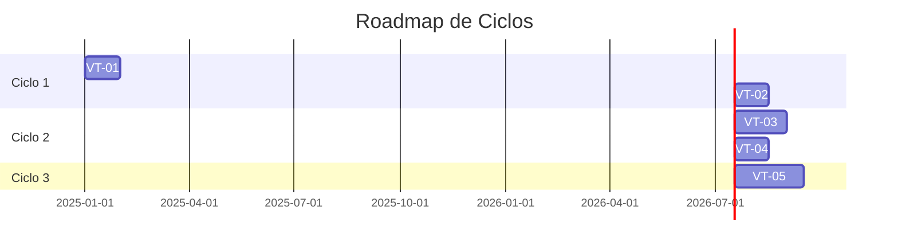
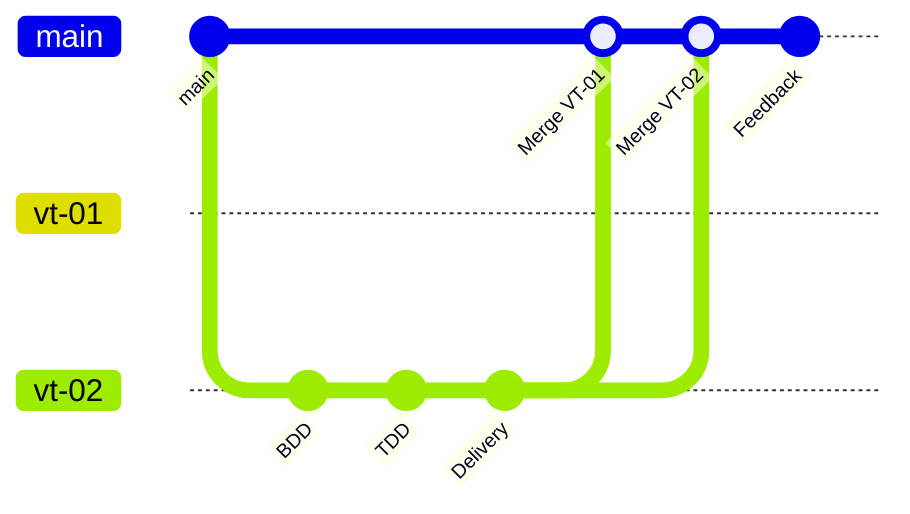
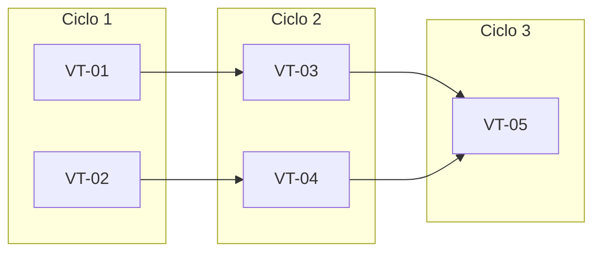

# Planejamento de Ciclos — [Nome do Projeto]

> **Status**: [Draft | Em Revisao | Aprovado]
>
> **Versao**: 1.0
>
> **Data**: [AAAA-MM-DD]
>
> **Aprovador**: [Nome do PO/Stakeholder]

---

## 1. Visao Macro do Produto

### 1.1 Resumo de ValueTracks (do MDD)

| ID | ValueTrack | Descricao | KPI Principal |
|----|------------|-----------|---------------|
| VT-01 | [Nome] | [Descricao curta] | [Metrica de valor] |
| VT-02 | [Nome] | [Descricao curta] | [Metrica de valor] |
| VT-03 | [Nome] | [Descricao curta] | [Metrica de valor] |

### 1.2 Resumo de SupportTracks

| ID | SupportTrack | Suporta | Meta |
|----|--------------|---------|------|
| ST-01 | [Nome] | VT-01, VT-02 | [Meta tecnica] |
| ST-02 | [Nome] | VT-03 | [Meta tecnica] |

---

## 2. Alocacao de ValueTracks em Ciclos

### Visao Geral

### Tabela de Alocacao

| Ciclo | ValueTracks | Justificativa | Sprints Estimados |
|-------|-------------|---------------|-------------------|
| **Ciclo 1** | VT-01, VT-02 | MVP funcional - valor minimo viavel | 2-3 sprints |
| **Ciclo 2** | VT-03, VT-04 | Capacidades avancadas - diferencial competitivo | 3-4 sprints |
| **Ciclo 3** | VT-05 | Expansao de mercado - novos segmentos | 2-3 sprints |

---

## 3. Detalhamento por Ciclo

### Ciclo 1: [Nome do Ciclo]

**Objetivo**: [Objetivo em 1-2 frases]

**ValueTracks incluidos**:
- [ ] **VT-01**: [Nome] — [Descricao do valor entregue]
- [ ] **VT-02**: [Nome] — [Descricao do valor entregue]

**SupportTracks necessarios**:
- [ ] **ST-01**: [Nome] — [Por que e necessario]

**Criterios de conclusao do ciclo**:
- [ ] Todos os ValueTracks com testes BDD passando
- [ ] KPIs definidos mensuraveis em ambiente de staging/producao
- [ ] Feedback coletado e documentado
- [ ] **E2E CLI-First Validation**:
  - [ ] Scripts E2E criados em `tests/e2e/cycle-XX/`
  - [ ] Stakeholder executou `./run-all.sh` e aprovou
  - [ ] Logs de evidencia salvos em `evidence/`

**Estimativas (Tres Dimensoes)**:

| Dimensao | Metrica | Valor |
|----------|---------|-------|
| **CUSTO** | Tokens | [X]k |
| | Custo IA (USD) | $[Y] |
| | Horas humanas | [Z]h |
| | Custo humano (USD) | $[W] |
| | **Custo Total** | **$[T]** |
| **ESFORCO** | Tokens | [X]k |
| | Horas | [Z]h |
| **PRAZO** | Tempo de ciclo | [A]-[B] dias |
| | Com paralelizacao | [C]-[D] dias |
| | Sprints | [N] |

---

### Ciclo 2: [Nome do Ciclo]

**Objetivo**: [Objetivo em 1-2 frases]

**ValueTracks incluidos**:
- [ ] **VT-03**: [Nome] — [Descricao do valor entregue]
- [ ] **VT-04**: [Nome] — [Descricao do valor entregue]

**Dependencias do Ciclo 1**:
- [ ] VT-01 concluido (pre-requisito para VT-03)
- [ ] ST-01 estavel

**Criterios de conclusao do ciclo**:
- [ ] [Criterio especifico]

**Estimativas (Tres Dimensoes)**:

| Dimensao | Metrica | Valor |
|----------|---------|-------|
| **CUSTO** | Tokens | [X]k |
| | Custo IA (USD) | $[Y] |
| | Horas humanas | [Z]h |
| | Custo humano (USD) | $[W] |
| | **Custo Total** | **$[T]** |
| **ESFORCO** | Tokens | [X]k |
| | Horas | [Z]h |
| **PRAZO** | Tempo de ciclo | [A]-[B] dias |
| | Com paralelizacao | [C]-[D] dias |
| | Sprints | [N] |

---

## 4. Estimativas Consolidadas (Tres Dimensoes)

> O ForgeProcess adota **tres dimensoes independentes** de metricas:
> - **CUSTO**: Quanto custa produzir (tokens x preco + horas x valor)
> - **ESFORCO**: Quanto trabalho e necessario (tokens IA + horas humanas)
> - **PRAZO**: Quando estara pronto (tempo de ciclo em dias)
>
> **PRINCIPIOS FUNDAMENTAIS**:
> - Tokens medem custo computacional, NAO tempo
> - Apenas "tempo de ciclo" responde "quando fica pronto?"
> - Paralelizacao reduz prazo (30-50%), NAO custo
> - Sempre usar ranges (min/max), nunca valores fixos

### 4.1 Visao Consolidada do Produto

| Dimensao | Ciclo 1 | Ciclo 2 | Ciclo 3 | **Total** |
|----------|---------|---------|---------|-----------|
| **CUSTO** | | | | |
| Tokens | 150k | 200k | 120k | **470k** |
| Custo IA (USD) | $2.25 | $3.00 | $1.80 | **$7.05** |
| Horas Humanas | 40h | 50h | 30h | **120h** |
| Custo Humano (USD) | $2,000 | $2,500 | $1,500 | **$6,000** |
| **Custo Total** | **$2,002** | **$2,503** | **$1,502** | **$6,007** |
| **ESFORCO** | | | | |
| Tokens | 150k | 200k | 120k | **470k** |
| Horas | 40h | 50h | 30h | **120h** |
| **PRAZO** | | | | |
| Tempo de Ciclo | 21-28d | 28-35d | 21-28d | **70-91d** |
| Com Paralelizacao | 14-20d | 20-25d | 14-20d | **49-64d** |
| Sprints | 3 | 4 | 3 | **10** |

### 4.2 Detalhamento: CUSTO

> **Quanto custa produzir o produto?**

| Ciclo | Tokens | Custo IA | Horas | Custo Humano | **Total USD** | Status |
|-------|--------|----------|-------|--------------|---------------|--------|
| Ciclo 1 | 150k | $2.25 | 40h | $2,000 | **$2,002** | [pendente] |
| Ciclo 2 | 200k | $3.00 | 50h | $2,500 | **$2,503** | [pendente] |
| Ciclo 3 | 120k | $1.80 | 30h | $1,500 | **$1,502** | [pendente] |
| **Total** | **470k** | **$7.05** | **120h** | **$6,000** | **$6,007** | - |

> *Configuracao de precos*:
> - Modelo: claude-sonnet-4-20250514
> - Custo por 1k tokens (output): $0.015
> - Valor/hora humano: $50

### 4.3 Detalhamento: ESFORCO

> **Quanto trabalho e necessario?**

| Ciclo | Tokens (IA) | Horas (Humano) | Breakdown Horas |
|-------|-------------|----------------|-----------------|
| Ciclo 1 | 150k | 40h | Review: 15h, Testes: 12h, Arquit.: 8h, Deploy: 5h |
| Ciclo 2 | 200k | 50h | Review: 20h, Testes: 15h, Arquit.: 10h, Deploy: 5h |
| Ciclo 3 | 120k | 30h | Review: 12h, Testes: 10h, Arquit.: 5h, Deploy: 3h |

> **IMPORTANTE**: Esforco NAO e prazo. 100k tokens + 20h humanas pode ser entregue
> em 3 dias ou 3 semanas, dependendo da paralelizacao e coordenacao.

### 4.4 Detalhamento: PRAZO

> **Quando estara pronto?**
> IMPORTANTE: Sempre usar ranges (min-max), nunca valores fixos.

| Ciclo | Tempo de Ciclo | Paralelizacao | Tempo Ajustado | Data Alvo |
|-------|----------------|---------------|----------------|-----------|
| Ciclo 1 | 21-28 dias | 2 agentes (-30%) | 14-20 dias | [DATA] |
| Ciclo 2 | 28-35 dias | 3 agentes (-40%) | 17-21 dias | [DATA] |
| Ciclo 3 | 21-28 dias | 2 agentes (-30%) | 14-20 dias | [DATA] |
| **Total** | **70-91 dias** | - | **49-64 dias** | **[DATA]** |

> **Sobre paralelizacao**:
> - 2 agentes: reducao tipica de 30-40%
> - 3-4 agentes: reducao tipica de 40-50%
> - 5+ agentes: rendimentos decrescentes (50-60% max)
>
> Fatores que limitam a reducao: conflitos de merge, review humano (gargalo), dependencias entre VTs.

### 4.5 Tracking de Variancia (Estimado vs. Consumido)

| Dimensao | Metrica | Estimado | Consumido | Variancia |
|----------|---------|----------|-----------|-----------|
| **CUSTO** | Tokens | 470k | - | - |
| | Custo IA (USD) | $7.05 | - | - |
| | Horas | 120h | - | - |
| | Custo Humano (USD) | $6,000 | - | - |
| | **Custo Total (USD)** | **$6,007** | - | - |
| **ESFORCO** | Tokens | 470k | - | - |
| | Horas | 120h | - | - |
| **PRAZO** | Dias | 49-64 | - | - |

> Atualizar esta tabela ao final de cada ciclo para calibrar estimativas futuras.

---

## 5. Paralelizacao de ValueTracks

> E comum — e recomendado — **paralelizar o desenvolvimento de ValueTracks independentes**
> usando multiplos agentes (ou times) trabalhando em branches separados.

### Estrategia de Paralelizacao

| ValueTrack | Branch | Agente/Time | Dependencias | Pode Paralelizar? |
|------------|--------|-------------|--------------|-------------------|
| VT-01 | `vt-01-checkout` | Agente A | Nenhuma | Sim |
| VT-02 | `vt-02-invoice` | Agente B | Nenhuma | Sim |
| VT-03 | `vt-03-shipping` | Agente C | VT-01 | Apos VT-01 |

### Fluxo de Branches

### Pre-requisitos para Paralelizar

- [ ] ValueTracks sao independentes (sem dependencias tecnicas bloqueantes)
- [ ] SupportTracks compartilhados estao estaveis
- [ ] Estrategia de merge definida (feature flags, trunk-based, etc.)
- [ ] Agentes/times alocados por ValueTrack

---

## 6. Riscos e Dependencias entre Ciclos

### Dependencias Criticas

### Riscos por Ciclo

| Ciclo | Risco | Probabilidade | Impacto | Mitigacao |
|-------|-------|---------------|---------|-----------|
| 1 | [Descricao] | ALTA/MEDIA/BAIXA | ALTO/MEDIO/BAIXO | [Acao] |
| 2 | [Descricao] | ALTA/MEDIA/BAIXA | ALTO/MEDIO/BAIXO | [Acao] |

---

## 7. Criterios de Revisao de MDD

> O MDD e feito **uma vez** no inicio do produto. Porem, pode ser revisitado se:

- [ ] Feedback do ciclo indica necessidade de **pivot** (mudar proposta de valor)
- [ ] Novos **segmentos de mercado** identificados
- [ ] **KPIs consistentemente nao atingidos** apos 2+ ciclos
- [ ] **Mudanca significativa** no cenario competitivo

**Gatilho para revisao de MDD**: Documentar em `project/docs/feedback/cycle-XX.md` com justificativa clara.

---

## 8. Processo de Atualizacao

Este documento deve ser atualizado:
- **Ao final de cada ciclo**: Ajustar estimativas dos ciclos futuros com base no aprendizado
- **Durante Feedback**: Se decisao de mudar escopo de ciclos futuros
- **Se MDD revisitado**: Realocar ValueTracks conforme nova visao

**Ultima atualizacao**: [AAAA-MM-DD] por [Nome]

---

## 9. Aprovacoes

- [ ] **Product Owner**: __________________ Data: __________
- [ ] **Tech Lead**: __________________ Data: __________
- [ ] **Stakeholder**: __________________ Data: __________

---

## Referencias

- Visao MDD: `project/docs/visao.md`
- ValueTracks e SupportTracks: `project/specs/bdd/tracks.yml`
- Roadmap de Sprints: `project/specs/roadmap/ROADMAP.md`
- Backlog detalhado: `project/specs/roadmap/BACKLOG.md`
