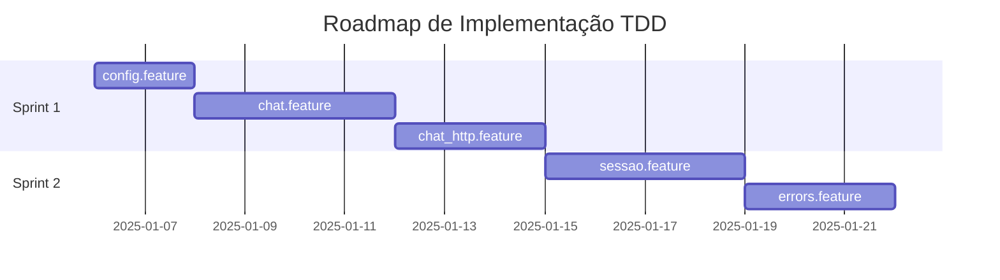

# TDD Roadmap — [Nome do Projeto]

> **Status**: [Draft | Em Revisão | Aprovado]
>
> **Versão**: 1.0
>
> **Data**: [AAAA-MM-DD]
>
> **Aprovador**: [Nome do PO/Stakeholder]

---

## 🎯 Objetivo

[Descrever em 2-3 frases o objetivo desta implementação baseado na visão MDD]

**Exemplo**: Implementar SDK Python (Forge) e servidor local (SymClient) que permitem desenvolvedores integrar múltiplos provedores LLM com interface unificada, reduzindo vendor lock-in e acelerando troca entre provedores.

---

## 📊 Timeline Executiva

### Sprint 1 (Semanas 1-2): [Nome da Fase]
**Track**: `[track_id]`
**Objetivo**: [Objetivo da sprint em 1 frase]

**Features**:
- ✅ [feature_name.feature] — [Descrição curta]
- ✅ [feature_name.feature] — [Descrição curta]

**Milestone 1**: [Critério de conclusão observável]

**Riscos**:
- [Risco identificado] → Mitigação: [Como vamos lidar]

---

### Sprint 2 (Semanas 3-4): [Nome da Fase]
**Track**: `[track_id]`
**Objetivo**: [Objetivo da sprint em 1 frase]

**Features**:
- ✅ [feature_name.feature] — [Descrição curta]

**Milestone 2**: [Critério de conclusão observável]

**Riscos**:
- [Risco identificado] → Mitigação: [Como vamos lidar]

---

## 📈 Gantt Visual

---

## 🎯 Milestones e Critérios de Conclusão

### Milestone 1: [Nome]
**Data prevista**: [AAAA-MM-DD]

**Critérios**:
- [ ] [Critério observável 1]
- [ ] [Critério observável 2]
- [ ] [Critério observável 3]

**Métricas**:
- [métrica_name]: Target [valor esperado]

---

### Milestone 2: [Nome]
**Data prevista**: [AAAA-MM-DD]

**Critérios**:
- [ ] [Critério observável 1]
- [ ] [Critério observável 2]

**Métricas**:
- [métrica_name]: Target [valor esperado]

---

## ⚠️ Riscos e Mitigações

| ID | Risco | Probabilidade | Impacto | Mitigação | Owner |
|----|-------|---------------|---------|-----------|-------|
| R1 | [Descrição do risco] | ALTA/MÉDIA/BAIXA | ALTO/MÉDIO/BAIXO | [Ação de mitigação] | @owner |
| R2 | [Descrição do risco] | ALTA/MÉDIA/BAIXA | ALTO/MÉDIO/BAIXO | [Ação de mitigação] | @owner |

**Exemplo**:
| ID | Risco | Probabilidade | Impacto | Mitigação | Owner |
|----|-------|---------------|---------|-----------|-------|
| R1 | Integração com llama.cpp mais complexa que esperado | MÉDIA | ALTO | Começar com echo provider mock, adiar llama.cpp para Sprint 2 | @tech-lead |

---

## 📦 Dependências Externas

- [ ] [Dependência 1] — Status: [Bloqueado/Em Andamento/Resolvido]
- [ ] [Dependência 2] — Status: [Bloqueado/Em Andamento/Resolvido]

**Exemplo**:
- [ ] Credenciais de API OpenRouter — Status: Aguardando procurement
- [ ] Acesso ao MCP Tecnospeed staging — Status: Ticket #123 aberto

---

## 🔄 Processo de Atualização

Este roadmap é **vivo** e deve ser atualizado:
- **Semanalmente** durante sprint review
- **Ad-hoc** quando riscos se materializam ou prioridades mudam
- **Ao completar milestone** (atualizar % de conclusão)

**Última atualização**: [AAAA-MM-DD] por [Nome]

---

---

## 🔄 Visão de Ciclos

> Para visão macro do produto completo, consulte `project/specs/roadmap/CYCLE_PLAN.md`

### Resumo do Planejamento de Ciclos

| Ciclo | ValueTracks | Sprints | Status |
|-------|-------------|---------|--------|
| Ciclo 1 | VT-01, VT-02 | 3 | [atual/pendente/completo] |
| Ciclo 2 | VT-03, VT-04 | 4 | pendente |
| Ciclo 3 | VT-05 | 3 | pendente |
| **Total** | **5 VTs** | **10** | - |

### Posição Atual

- **Ciclo atual**: [cycle-01]
- **Progresso do produto**: [X]% ([ciclos completos]/[total ciclos])
- **Sprints restantes estimados**: [N]

> Detalhes completos de alocação ValueTracks → Ciclos em `project/specs/roadmap/CYCLE_PLAN.md`

---

## 📚 Referências

- Visão MDD: `project/docs/visao.md`
- Features BDD: `project/specs/bdd/**/*.feature`
- Backlog detalhado: `project/specs/roadmap/BACKLOG.md`
- Estimativas: `project/specs/roadmap/estimates.yml`
- Dependências: `project/specs/roadmap/dependency_graph.md`
- **Planejamento de Ciclos**: `project/specs/roadmap/CYCLE_PLAN.md`

---

**Aprovações**:

- [ ] **Product Owner**: __________________ Data: __________
- [ ] **Tech Lead**: __________________ Data: __________
- [ ] **Stakeholder**: __________________ Data: __________
