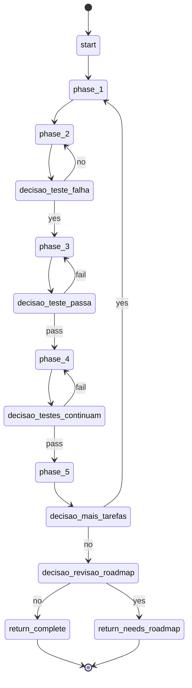

# Resumo do Processo

**ID:** `tdd`
**Versão:** 1.0.0
**Título:** TDD - Test Driven Development
**Tipo:** Subprocesso

**Descrição:**
> Implementação guiada por testes usando ciclo Red-Green-Refactor, transformando especificações BDD em código testado.

## Fases

| Fase | Nome | Passos | Subprocesso |
|------|------|--------|-------------|
| `tdd_cycle` | TDD Cycle | 5 | - |

## Fluxo

**Total de nós:** 13

| Tipo | Quantidade |
|------|------------|
| 🔀 Decisão | 5 |
| ↩ Retorno | 2 |
| ▶ Início | 1 |
| 📋 Passo | 5 |

**Decisões:**
- 👤 HIL (humanas): 1
- 🤖 Automáticas: 4

---

## Diagrama de Fluxo

```mermaid
flowchart TD
    start(["▶ Início"])
    phase_1["Selecionar tarefa do backlog"]
    phase_2["Escrever teste (RED)"]
    decisao_teste_falha{"🤖 Teste falha pelo motivo esperado..."}
    phase_3["Implementar código mínimo (GREEN)"]
    decisao_teste_passa{"🤖 Teste está passando após impleme..."}
    phase_4["Refatorar código"]
    decisao_testes_continuam{"🤖 Refatoração manteve todos os tes..."}
    phase_5["Commit e atualizar backlog"]
    decisao_mais_tarefas{"🤖 Existem mais tarefas pendentes n..."}
    decisao_revisao_roadmap{"👤 Durante TDD surgiram necessidade..."}
    return_complete(("↩ return: complete"))
    return_needs_roadmap(("↩ return: needs_roadmap_revision"))

    start --> phase_1
    phase_1 --> phase_2
    phase_2 --> decisao_teste_falha
    decisao_teste_falha -->|"yes"| phase_3
    decisao_teste_falha -->|"no"| phase_2
    phase_3 --> decisao_teste_passa
    decisao_teste_passa -->|"pass"| phase_4
    decisao_teste_passa -->|"fail"| phase_3
    phase_4 --> decisao_testes_continuam
    decisao_testes_continuam -->|"pass"| phase_5
    decisao_testes_continuam -->|"fail"| phase_4
    phase_5 --> decisao_mais_tarefas
    decisao_mais_tarefas -->|"yes"| phase_1
    decisao_mais_tarefas -->|"no"| decisao_revisao_roadmap
    decisao_revisao_roadmap -->|"no"| return_complete
    decisao_revisao_roadmap -->|"yes"| return_needs_roadmap

    %% Estilos
    classDef startEnd fill:#d4edda,stroke:#28a745,stroke-width:2px
    classDef stepNode fill:#e1f5ff,stroke:#333,stroke-width:1px
    classDef decisionNode fill:#fff4e6,stroke:#ff9800,stroke-width:2px
    classDef subprocessCall fill:#e8daef,stroke:#8e44ad,stroke-width:2px
    classDef returnNode fill:#fadbd8,stroke:#e74c3c,stroke-width:2px
    class start startEnd
    class phase_1,phase_2,phase_3,phase_4,phase_5 stepNode
    class decisao_teste_falha,decisao_teste_passa,decisao_testes_continuam,decisao_mais_tarefas,decisao_revisao_roadmap decisionNode
    class return_complete,return_needs_roadmap returnNode
```

---

## Diagrama de Estados

