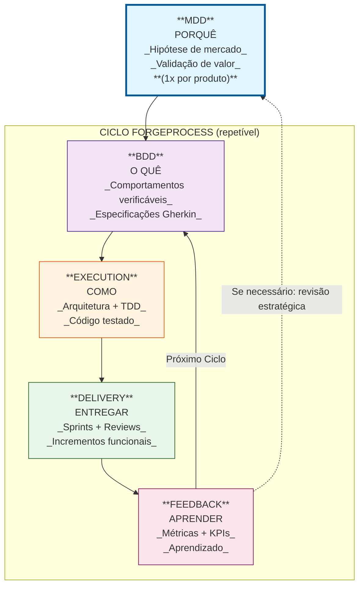
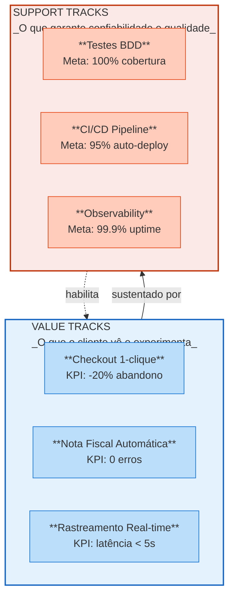
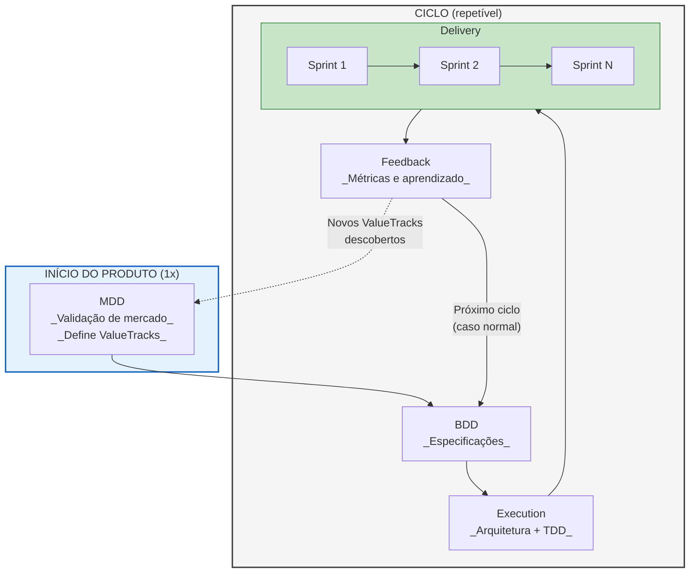
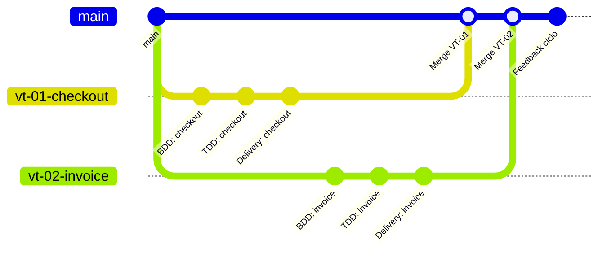
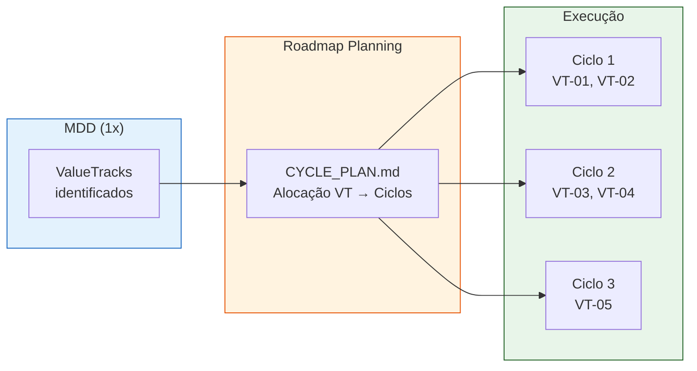

# ForgeProcess: um processo de desenvolvimento para a era dos tokens

## Introdução

O desenvolvimento de software entrou na era dos agentes LLM. Times humanos deixaram de ser os únicos produtores de código, e a métrica clássica de esforço — horas, dias, story points — continua válida, **mas já não é suficiente**. Hoje, o que mede trabalho, para além das horas humanas, é também o **consumo de tokens** pelos agentes de IA.

Nesse novo cenário, metodologias tradicionais seguem úteis, mas se mostram incompletas por vezes: medem movimento, mas não medem **valor**.

O ForgeProcess nasce para resolver isso. Ele organiza o desenvolvimento em ciclos orientados a valor, independentemente de quem escreve o código — humanos, agentes ou ambos. Ao incorporar **tokens como unidade de esforço**, o ForgeProcess adiciona previsibilidade a algo que antes era nebuloso: o custo real de produzir software com IA em ambientes complexos.

Este artigo apresenta os pilares do ForgeProcess na era dos tokens: ciclos de raciocínio, ValueTracks, SupportTracks e a hierarquia entre ciclos e sprints — agora unificados por um modelo econômico que integra trabalho humano e computação de IA.

------

## O Ciclo de Raciocínio

O ForgeProcess opera através de **ciclos de raciocínio** — iterações completas que transformam intenção em execução e aprendizado. Cada ciclo atravessa cinco fases sequenciais:

1. **MDD (Market-Driven Development)**: Validação da hipótese de mercado. Define o "porquê" do sistema existir.
2. **BDD (Behavior-Driven Development)**: Tradução do valor em comportamentos verificáveis. Define o "o quê" o sistema faz.
3. **Execution**: Planejamento arquitetural e implementação guiada por testes (TDD). Define o "como" construir.
4. **Delivery**: Organização do trabalho em sprints e entrega incremental.
5. **Feedback**: Coleta de métricas, análise de KPIs e aprendizado para o próximo ciclo.

A característica distintiva do ciclo é sua natureza **fechada**: o feedback da última fase alimenta ajustes nas fases iniciais do ciclo seguinte.

> **Nota sobre o MDD**: A fase MDD é tipicamente executada **uma única vez** no início do produto, estabelecendo visão, ValueTracks e proposta de valor. Nos ciclos subsequentes, o MDD não é refeito — mas pode ser **revisitado** se o feedback indicar necessidade de ajuste estratégico (pivô, expansão de escopo, novos mercados). A maioria dos ciclos inicia diretamente no BDD, refinando comportamentos com base no aprendizado.

------

## ValueTracks e SupportTracks: A Arquitetura do Valor

O ForgeProcess distingue dois tipos fundamentais de fluxos de trabalho: **ValueTracks** e **SupportTracks**. Essa distinção é central para garantir que o esforço técnico esteja sempre alinhado com a entrega de valor.

### ValueTracks

ValueTracks são fluxos que entregam **valor direto ao usuário** — funcionalidades que o cliente percebe, utiliza e pelas quais está disposto a pagar. Cada ValueTrack possui:

- Uma descrição clara do comportamento entregue;
- Uma métrica de valor mensurável (KPI);
- Stakeholders identificados.

Exemplos: "Checkout em 1 clique", "Emissão automática de nota fiscal", "Rastreamento de pedido em tempo real".

### SupportTracks

SupportTracks são fluxos que **sustentam a entrega de valor** — infraestrutura técnica que garante confiabilidade, qualidade e escalabilidade. Não são percebidos diretamente pelo usuário, mas são indispensáveis para que os ValueTracks funcionem.

Exemplos: "Pipeline CI/CD", "Testes automatizados BDD", "Monitoramento e observabilidade".

### A Relação Bidirecional

A relação entre ValueTracks e SupportTracks é **bidirecional e complementar**:

- **Value → Support**: Um novo ValueTrack gera demanda por SupportTracks. "Checkout em 1 clique" requer "Testes automatizados de pagamento".
- **Support → Value**: SupportTracks robustos habilitam novos ValueTracks. "Pipeline CI/CD confiável" permite "Entregas frequentes com baixo risco".

> **Regra fundamental**: Sem ValueTracks, o sistema não tem propósito. Sem SupportTracks, o valor não se sustenta.

------

## Ciclos versus Sprints: Hierarquia Temporal

Uma fonte comum de confusão é a relação entre ciclos e sprints. A distinção é hierárquica: **sprints estão contidos em ciclos**.

### Ciclo (Macro)

- **Escopo**: Todo o processo (MDD → BDD → Execution → Delivery → Feedback);
- **Duração**: Semanas a meses;
- **Propósito**: Entregar valor de negócio completo e validado;
- **Quantidade típica**: 1–3 ciclos por produto;
- **Pergunta central**: "Estamos entregando o valor certo?".

### Sprint (Micro)

- **Escopo**: Apenas dentro da fase Delivery;
- **Duração**: 1–2 semanas;
- **Propósito**: Entregar incrementos de código funcionais;
- **Quantidade típica**: Múltiplos sprints por ciclo;
- **Pergunta central**: "Estamos implementando o backlog corretamente?".

**Fluxo após Feedback:**

- **Caso normal**: Volta para BDD → inicia o próximo ciclo com ValueTracks já validados;
- **Novos ValueTracks descobertos**: Volta para MDD → valida mercado antes de especificar novos comportamentos.

O ciclo é o **veículo estratégico** que garante alinhamento com o valor de negócio. O sprint é a **unidade operacional** que organiza o trabalho de implementação.

------

## Paralelização de ValueTracks

É comum — e recomendado — **paralelizar o desenvolvimento de ValueTracks independentes** usando múltiplos agentes (ou times) trabalhando em branches separados:

**Benefícios da paralelização:**

- **Acelera entregas**: ValueTracks sem dependência entre si avançam simultaneamente;
- **Isola riscos**: Problemas em um VT não bloqueiam outros;
- **Escala com agentes**: Múltiplos agentes LLM ou times humanos podem trabalhar em paralelo, cada um focado em seu ValueTrack;
- **Merge controlado**: Integração acontece após cada VT passar por seu ciclo completo (BDD → TDD → Delivery).

**Pré-requisitos para paralelizar:**

- ValueTracks devem ser **independentes** (sem dependências técnicas bloqueantes);
- SupportTracks compartilhados devem estar **estáveis** antes de iniciar;
- Estratégia de merge definida (feature flags, trunk-based, etc.).

------

## Planejamento de Ciclos: Visão do Produto Completo

Uma pergunta frequente em projetos de software é: **"Quanto falta para terminar?"**. O ForgeProcess responde a essa pergunta através do **Planejamento de Ciclos**, uma etapa do Roadmap Planning que aloca ValueTracks em ciclos antes do início da implementação.

### Por que planejar ciclos?

Sem uma visão macro do produto, equipes caem na armadilha de planejar sprint a sprint, perdendo perspectiva estratégica. O resultado: incerteza sobre conclusão, dificuldade em comunicar progresso e decisões de priorização sem contexto.

### O que é o CYCLE_PLAN?

Durante o Roadmap Planning, após definir arquitetura e backlog, a equipe cria o `CYCLE_PLAN.md` — um documento que mapeia todos os ValueTracks identificados no MDD em ciclos específicos:

### Métricas consolidadas

O CYCLE_PLAN fornece visibilidade total:

| Métrica                    | Exemplo    |
| -------------------------- | ---------- |
| Total de ciclos planejados | 3          |
| Total de ValueTracks       | 5          |
| Total de sprints estimados | 10         |
| **Tokens estimados**       | **470k**   |
| Custo estimado (USD)       | ~$7.00     |

Com essas informações, stakeholders podem responder: **"O produto completo requer 3 ciclos, aproximadamente 10 sprints, com custo estimado de 470k tokens (~$7 USD)."**

### Quando revisar o planejamento

O CYCLE_PLAN não é estático. Deve ser revisado:

- Ao final de cada ciclo (ajuste de estimativas futuras);
- Se o feedback indicar mudança de escopo;
- Se o MDD for revisitado (realocação de ValueTracks).

------

## Tokens como Unidade de Esforço

Quando o desenvolvimento é conduzido por **agentes LLM**, a unidade tradicional de esforço — horas de trabalho — deixa de fazer sentido direto. O ForgeProcess adota **tokens** como métrica de esforço para desenvolvimento assistido por IA.

### Por que tokens?

| Métrica tradicional | Problema                      | Métrica ForgeProcess       |
| ------------------- | ----------------------------- | -------------------------- |
| Horas trabalhadas   | Agentes não "trabalham horas" | **Tokens consumidos**      |
| Story points        | Subjetivo, varia entre times  | **Tokens estimados**       |
| Dias de sprint      | Não reflete custo real da IA  | **Custo = tokens × preço** |

Tokens permitem:

- **Previsibilidade de custo**: o orçamento pode ser estimado antes de iniciar;
- **Comparação objetiva**: features diferentes são comparadas na mesma unidade;
- **Controle fino**: consumo real × estimado pode ser acompanhado por ciclo;
- **Escalabilidade**: paralelizar agentes aumenta throughput, não o custo por token.

### Referência de conversão

| Complexidade | Tokens estimados | Exemplo                              |
| ------------ | ---------------- | ------------------------------------ |
| XS           | 5k–15k           | Ajuste de config, fix simples        |
| S            | 15k–40k          | Feature pequena, um endpoint         |
| M            | 40k–100k         | Feature média, múltiplos arquivos    |
| L            | 100k–250k        | Feature complexa, integração externa |
| XL           | 250k+            | Deve ser quebrada em partes menores  |

Esses valores servem como linha de base — cada time pode calibrar a tabela conforme histórico e domínio do produto.

### Onde registrar

- **Estimativas por feature / VT**: `project/specs/roadmap/estimates.yml` (campo `tokens_estimated`);
- **Consolidação por ciclo**: `project/specs/roadmap/CYCLE_PLAN.md` (seção de custos por ciclo);
- **Tracking em tempo de execução**: `process/state/forgeprocess_state.yml`
  - `tokens.total_estimated`
  - `tokens.total_consumed`

Assim, o ForgeProcess consegue responder não só *“o que vamos entregar”*, mas também *“quanto isso custará em tokens”* e *“quanto, de fato, foi consumido”*.

------

## Conclusão

O ForgeProcess representa uma abordagem disciplinada para desenvolvimento de software orientado a valor. Seus ciclos de raciocínio garantem que cada linha de código seja rastreável até uma intenção de negócio validada. A distinção entre ValueTracks e SupportTracks estabelece um contrato claro entre o que entrega valor e o que sustenta essa entrega.

A hierarquia ciclo–sprint resolve a tensão entre visão estratégica e execução tática. Ciclos mantêm o foco no valor; sprints organizam o trabalho. A métrica de tokens fecha o circuito econômico do desenvolvimento com agentes LLM, permitindo estimar, acompanhar e otimizar custos de forma objetiva.

O resultado é um framework que responde não apenas "quanto entregamos", mas "quanto valor criamos" — a pergunta que realmente importa.

------

**Autor**: ForgeProcess Documentation Team
 **Versão**: 1.2 (revisada)
 **Data**: 2025-12-09
