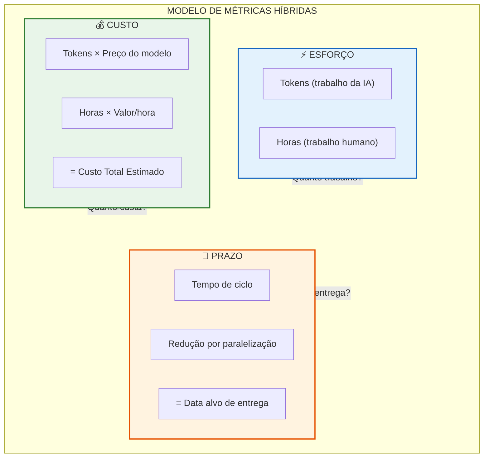
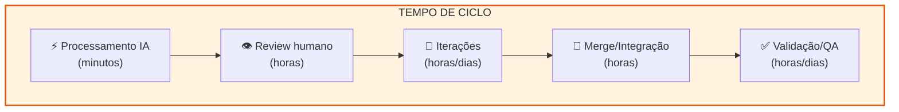
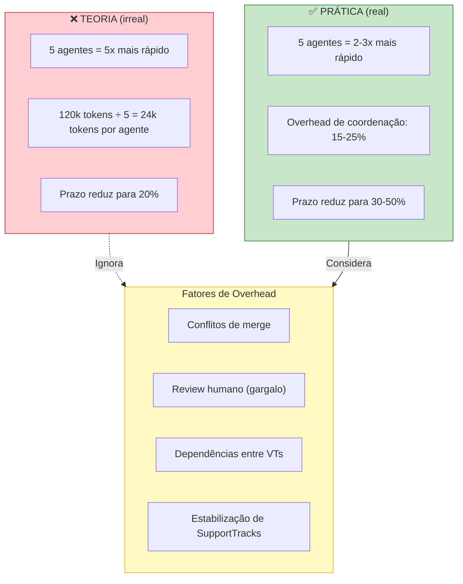
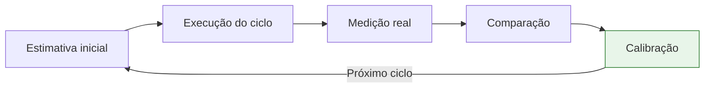

# ForgeProcess: Métricas para Desenvolvimento Híbrido (Humanos + IA)

## Introdução

O desenvolvimento de software entrou em uma nova era. Times humanos e agentes de IA agora trabalham juntos na construção de produtos. Essa mudança traz ganhos expressivos em velocidade e qualidade, mas também expõe uma limitação das métricas tradicionais: **horas, dias e story points já não representam sozinhos o esforço total do trabalho**.

Humanos trabalham em horas. Agentes de IA trabalham em tokens. O produto é construído por ambos.

Para manter previsibilidade e clareza, o ForgeProcess adota um modelo de **três dimensões** que separa explicitamente o que cada métrica representa:

| Dimensão | O que mede | Unidade |
|----------|------------|---------|
| **Custo** | Quanto custa produzir | USD (tokens × preço + horas × valor) |
| **Esforço** | Quanto trabalho é necessário | Tokens (IA) + Horas (humanos) |
| **Prazo** | Quando estará pronto | Dias (tempo de ciclo) |

Este artigo explica cada dimensão, suas interações e como aplicá-las no planejamento de ciclos.

---

## O Problema das Métricas Tradicionais

### Por que horas não bastam?

Métricas baseadas em tempo funcionam bem para trabalho humano:
- 1 desenvolvedor × 8 horas = 8 horas de esforço
- 2 desenvolvedores × 8 horas = 16 horas de esforço

Mas agentes de IA não "trabalham horas". Eles processam tokens. E a relação entre tokens e tempo é **instável**:

- O mesmo volume de tokens pode ser processado em segundos ou minutos
- A velocidade depende do modelo, da tarefa e dos limites de API
- Não existe "taxa fixa" de tokens por hora

Tentar converter tokens em horas cria uma abstração falsa que induz erros de planejamento.

### Por que tokens não bastam?

Tokens medem volume de processamento e custo computacional. Mas não respondem à pergunta que stakeholders mais fazem:

> **"Quando vai ficar pronto?"**

Tokens não têm relação direta com prazo porque:
- O processamento de IA pode ser rápido, mas a entrega depende de humanos
- Reviews, testes, merges e validações consomem tempo real
- Dependências entre ValueTracks criam gargalos

---

## As Três Dimensões do Trabalho Híbrido

O ForgeProcess resolve esse problema separando claramente três conceitos:



---

### Dimensão 1: Custo

**O que mede**: Quanto dinheiro será gasto para produzir o ValueTrack ou ciclo.

**Componentes**:

| Componente | Cálculo | Exemplo |
|------------|---------|---------|
| Custo de IA | Tokens × preço por token | 120k tokens × $0.015/1k = $1.80 |
| Custo humano | Horas × valor/hora | 16h × $50/h = $800 |
| **Custo total** | Soma | **$801.80** |

**Princípio fundamental**:

> **Tokens medem custo computacional. Não medem tempo e não devem ser interpretados como prazo.**

**Onde registrar**:
- Estimativas por feature: `project/specs/roadmap/estimates.yml`
- Consolidação por ciclo: `project/specs/roadmap/CYCLE_PLAN.md`

---

### Dimensão 2: Esforço

**O que mede**: Quanto trabalho é necessário — separando contribuições de IA e humanos.

**Esforço de IA** (medido em tokens):

| Complexidade | Tokens | Exemplo |
|--------------|--------|---------|
| XS | 5k–15k | Ajuste de config, fix simples |
| S | 15k–40k | Feature pequena, um endpoint |
| M | 40k–100k | Feature média, múltiplos arquivos |
| L | 100k–250k | Feature complexa, integração externa |
| XL | 250k+ | Deve ser quebrada em partes menores |

**Esforço humano** (medido em horas):

| Atividade | Descrição |
|-----------|-----------|
| Revisão de código | Análise crítica do output da IA |
| Ajustes de arquitetura | Decisões que a IA não pode tomar |
| Merges entre branches | Integração de ValueTracks paralelos |
| Testes funcionais | Validação de comportamento |
| QA e validação | Garantia de qualidade |
| Deploy e acompanhamento | Entrega em produção |

**Importante**: Esforço não é prazo. Um ValueTrack pode exigir 100k tokens + 20 horas humanas, mas o prazo depende de como esse trabalho é distribuído no tempo.

---

### Dimensão 3: Prazo

**O que mede**: Quando o trabalho estará concluído — a única métrica que responde "quando fica pronto?".

**Métrica central**: Tempo de ciclo

O tempo de ciclo combina:
- Tempo de processamento dos agentes (geralmente rápido)
- Tempo humano necessário (reviews, decisões, validações)
- Coordenação entre ValueTracks
- Dependências técnicas
- Overhead de integração (merges, conflitos, estabilização)



**Estimativas em ranges**: Sempre usar intervalos, nunca números fixos.

| Bom | Ruim |
|-----|------|
| "3-5 dias" | "4 dias" |
| "1-2 semanas" | "8 dias" |

---

## Como a Paralelização Afeta as Dimensões

Uma das grandes vantagens dos agentes de IA é a capacidade de trabalhar em paralelo. Mas o impacto da paralelização é **assimétrico**:

| Dimensão | Efeito da paralelização |
|----------|-------------------------|
| **Custo** | Não muda — soma dos tokens permanece igual |
| **Esforço** | Não muda — trabalho total é o mesmo |
| **Prazo** | **Reduz** — mas não linearmente |

### Por que a redução não é linear?

Se 5 agentes trabalham em paralelo, **não** entregam em 1/5 do tempo. Na prática:



### Regra prática para estimativas

| Agentes paralelos | Redução típica de prazo |
|-------------------|-------------------------|
| 2 | 30-40% |
| 3-4 | 40-50% |
| 5+ | 50-60% (rendimentos decrescentes) |

**Princípio**:

> **Paralelização reduz prazo. Não reduz custo.**

---

## Modelo Unificado: Exemplo Prático

Para cada ValueTrack e cada Ciclo, o ForgeProcess registra:

### Exemplo: ValueTrack "Checkout 1-clique"

```yaml
valuetrack: VT-01-checkout
name: "Checkout em 1 clique"

# DIMENSÃO 1: CUSTO
custo:
  tokens_estimados: 80000
  custo_ia: 1.20              # USD (80k × $0.015/1k)
  horas_humanas: 12
  custo_humano: 600.00        # USD (12h × $50/h)
  custo_total: 601.20         # USD

# DIMENSÃO 2: ESFORÇO
esforco:
  tokens: 80000               # trabalho da IA
  horas: 12                   # trabalho humano
  breakdown_horas:
    review: 4
    testes: 4
    merge_deploy: 4

# DIMENSÃO 3: PRAZO
prazo:
  tempo_ciclo_estimado: "4-6 dias"
  paralelizacao_aplicada: true
  reducao_por_paralelizacao: "30%"
  tempo_ciclo_ajustado: "3-4 dias"
  data_alvo: "2025-12-15"
```

### Visualização consolidada

```
┌─────────────────────────────────────────────────────────────┐
│           VT-01: CHECKOUT 1-CLIQUE                          │
├─────────────────────────────────────────────────────────────┤
│  💰 CUSTO                    │  📅 PRAZO                    │
│  ─────────────────           │  ─────────────────           │
│  Tokens: 80k (~$1.20)        │  Tempo de ciclo: 4-6 dias    │
│  Horas: 12h (~$600)          │  Com paralelização: 3-4 dias │
│  ─────────────────           │  ─────────────────           │
│  Total: ~$601                │  Entrega: 15/12/2025         │
├─────────────────────────────────────────────────────────────┤
│  ⚡ ESFORÇO                                                  │
│  IA: 80k tokens | Humano: 12h (review 4h, testes 4h, etc.) │
└─────────────────────────────────────────────────────────────┘
```

---

## Calibração com Dados Históricos

Estimativas iniciais são aproximações. O ForgeProcess recomenda calibração contínua:

1. **Ao final de cada ciclo**: Comparar estimado × consumido
2. **Ajustar referências**: Se ciclos consistentemente consomem 20% mais tokens, ajustar a tabela de complexidade
3. **Refinar tempo de ciclo**: Medir tempo real de entrega e ajustar ranges



**Métricas de tracking** (em `forgeprocess_state.yml`):

```yaml
metricas:
  custo:
    tokens:
      total_estimado: 470000
      total_consumido: 512000
    total_estimado_usd: 7050.00
    total_consumido_usd: 7680.00
    variancia_percent: 9        # consumiu 9% mais que estimado

  esforco:
    tokens_estimados: 470000
    tokens_consumidos: 512000
    horas_estimadas: 120
    horas_consumidas: 135

  prazo:
    ciclo_estimado_dias:
      min: 49
      max: 64
    dias_decorridos: 58
```

---

## Conclusão

O modelo de três dimensões do ForgeProcess resolve a ambiguidade das métricas tradicionais:

| Pergunta | Dimensão | Resposta |
|----------|----------|----------|
| "Quanto vai custar?" | Custo | Tokens × preço + horas × valor |
| "Quanto trabalho é?" | Esforço | X tokens (IA) + Y horas (humanos) |
| "Quando fica pronto?" | Prazo | Tempo de ciclo estimado: N-M dias |

Essa separação evita interpretações equivocadas e permite comunicação clara entre áreas técnicas e executivas. O resultado: **previsibilidade real em um processo que agora é híbrido**.

---

## Referências

**Artefatos relacionados**:
- Template de estimativas: `process/execution/roadmap_planning/templates/template_estimates.yml`
- Template de planejamento de ciclos: `process/execution/roadmap_planning/templates/template_cycle_plan.md`
- Estado do processo: `process/state/forgeprocess_state.yml`
- Schema de validação: `process/execution/roadmap_planning/schemas/estimates.schema.json`

---

**Autor**: ForgeProcess Documentation Team
**Versão**: 1.1
**Data**: 2025-12-09
