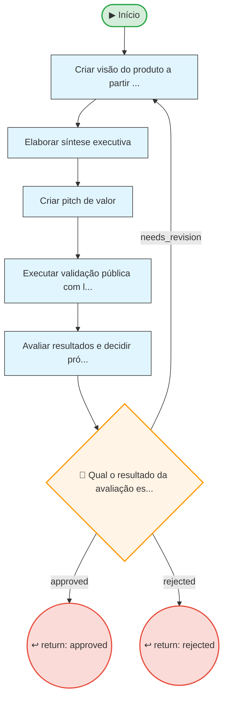
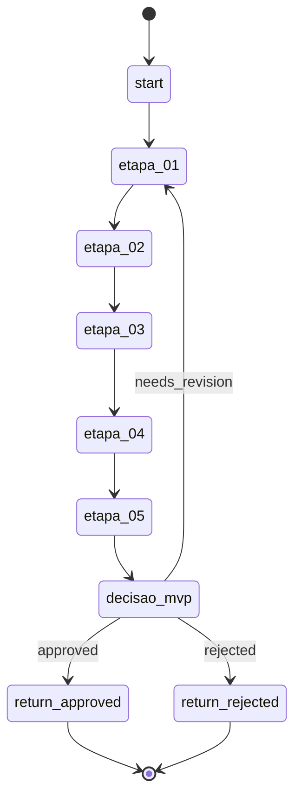

# Resumo do Processo

**ID:** `mdd`
**Versão:** 1.0.0
**Título:** MDD - Market Driven Development
**Tipo:** Subprocesso

**Descrição:**
> Processo de validação de mercado que transforma hipóteses em produtos validados através de artefatos Markdown versionáveis.

## Fases

| Fase | Nome | Passos | Subprocesso |
|------|------|--------|-------------|
| `mdd_main` | Market Driven Development | 5 | - |

## Fluxo

**Total de nós:** 9

| Tipo | Quantidade |
|------|------------|
| 🔀 Decisão | 1 |
| ↩ Retorno | 2 |
| ▶ Início | 1 |
| 📋 Passo | 5 |

**Decisões:**
- 👤 HIL (humanas): 1

---

## Diagrama de Fluxo

---

## Diagrama de Estados

