# Resumo do Processo

**ID:** `mdd`
**Versão:** 1.0.0
**Título:** MDD - Market Driven Development
**Tipo:** Subprocesso

**Descrição:**
> Processo de validação de mercado que transforma hipóteses em produtos validados através de artefatos Markdown versionáveis.

## Fases

| Fase | Nome | Passos | Subprocesso |
|------|------|--------|-------------|
| `mdd_main` | Market Driven Development | 5 | - |

## Fluxo

**Total de nós:** 9

| Tipo | Quantidade |
|------|------------|
| 🔀 Decisão | 1 |
| ↩ Retorno | 2 |
| ▶ Início | 1 |
| 📋 Passo | 5 |

**Decisões:**
- 👤 HIL (humanas): 1

---

## Diagrama de Fluxo

```mermaid
flowchart TD
    start(["▶ Início"])
    etapa_01["Criar visão do produto a partir ..."]
    etapa_02["Elaborar síntese executiva"]
    etapa_03["Criar pitch de valor"]
    etapa_04["Executar validação pública com l..."]
    etapa_05["Avaliar resultados e decidir pró..."]
    decisao_mvp{"👤 Qual o resultado da avaliação es..."}
    return_approved(("↩ return: approved"))
    return_rejected(("↩ return: rejected"))

    start --> etapa_01
    etapa_01 --> etapa_02
    etapa_02 --> etapa_03
    etapa_03 --> etapa_04
    etapa_04 --> etapa_05
    etapa_05 --> decisao_mvp
    decisao_mvp -->|"approved"| return_approved
    decisao_mvp -->|"needs_revision"| etapa_01
    decisao_mvp -->|"rejected"| return_rejected

    %% Estilos
    classDef startEnd fill:#d4edda,stroke:#28a745,stroke-width:2px
    classDef stepNode fill:#e1f5ff,stroke:#333,stroke-width:1px
    classDef decisionNode fill:#fff4e6,stroke:#ff9800,stroke-width:2px
    classDef subprocessCall fill:#e8daef,stroke:#8e44ad,stroke-width:2px
    classDef returnNode fill:#fadbd8,stroke:#e74c3c,stroke-width:2px
    class start startEnd
    class etapa_01,etapa_02,etapa_03,etapa_04,etapa_05 stepNode
    class decisao_mvp decisionNode
    class return_approved,return_rejected returnNode
```

---

## Diagrama de Estados

